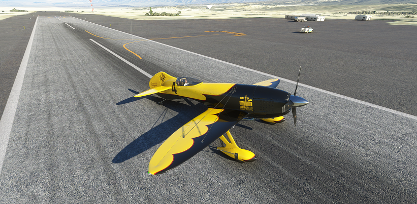
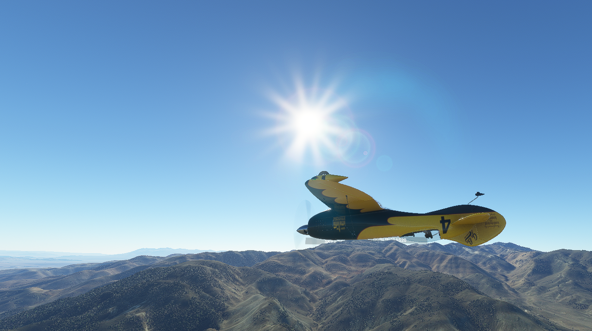

# Flying Planes with Python and JavaScript

<figure style="width: 40%; margin: auto; margin-bottom: 1em;" >
  <a href="python-flying-airplane.png" target="_blank">
    
  </a>      
  <figcaption style="font-style: italic; text-align: center;">Flying planes with Python, you say?<br><sub>(image created by Dall-E)</sub></figcaption>
</figure>


To allay any concerns: this will not be actually running Python or JavaScript software in the cockpit of a real aircraft in order to effect automated flight: that would kill people. Instead, we're writing a web page that can control an autopilot running in Python that in turn controls a little virtual aeroplane. And by "little" I actually mean "any aeroplane in [Microsoft Flight Simulator](https://www.flightsimulator.com/)" because as it turns out, MSFS comes with an API that can be used to both query _and set_ values relating from anything as simple as cockpit lights to something as complex as spawning a fleet of aircraft and making them perform formation flights while making their smoke pattern spell out the works of Chaucer in its original middle English.

While we're not doing that (today), we _are_ going to write an autopilot for planes that don't have one, as well as planes that do have one but that are just a 1950's chore to work with, like the one in my favourite real-life plane, the [DeHavilland DHC-2 "Beaver"](https://en.wikipedia.org/wiki/De_Havilland_Canada_DHC-2_Beaver), originally made by DeHavilland but these days made by [Viking Air](https://www.vikingair.com/viking-aircraft/dhc-2-beaver). Specifically, the float plane version, which flies between [Vancouver](https://www.openstreetmap.org/relation/2218280) and Eastern [Vancouver Island](https://www.openstreetmap.org/relation/2249770) and locations dotted around the [Strait of Georgia](https://www.openstreetmap.org/relation/13321885)). I don't have a pilot's license, but the nice thing about tiny flights is that you regularly get to sit in the copilot seat, and enjoy beautiful British Columbia from only 300m up.

<figure style="width: 40%; margin: auto; margin-bottom: 1em;" >
  <a href="https://harbourair.com/flight-info/flight/locations" target="_blank">
    
  </a>
  <figcaption style="font-style: italic; text-align: center;">In case anyone is visiting Vancouver...<br><sub>(Map owned by Harbour Air)</sub></figcaption>
</figure>

But back to Python and JavaScript: MSFS comes with an SDK called the [SimConnect SDK](https://docs.flightsimulator.com/html/Programming_Tools/SimConnect/SimConnect_SDK.htm) that lets people write addons for the game using C, C++, or languages with .NET support, and so of course folks have been writing connectors in those languages to "proxy" the SimConnect calls to officially unsupported languages like Go, Node, Python, etc. And so, of course, my first thought was "cool, I can write an express server that connects to MSFS?" Except the reality is that: no, at least not directly. The `node-simconnect` package is rather incomplete, and so instead we reach for the next best thing: [python-simconnect](https://pypi.org/project/SimConnect/). We now need two languages, but they're both fairly easy to work with so why not.

Using `python-simconnect`, we can write a tiny Python webserver with `GET` calls for querying MSFS, and `POST` calls for setting values in-sim. Although it turns out that even `python-simconnect` is incomplete (although far less so), so we're actually using [a fork I made](https://github.com/Pomax/Python-SimConnect/tree/edits) that makes some improvements we need to in order to tell all the different states that MSFS can be in apart, as well as adding a few missing sim variables, and renaming some that had the wrong name.

Using that, we can write some good old static HTML with some plain JS that uses [the Fetch API](https://developer.mozilla.org/en-US/docs/Web/API/Fetch_API/Using_Fetch) to talk to our simple Python API server for all its needs.

### A simple Python API server

Let's write a simple Python script that sets up a "SimConnection" object (which will handle all the MSFS connector logic), a `GET` route for getting values out of MSFS, and a `POST` route for setting values in MSFS.

```python
import json
from http.server import BaseHTTPRequestHandler, HTTPServer
from urllib.parse import parse_qs, urlparse
from simconnection import SimConnection

host_name = "localhost"
server_port = 8080
sim_connection = None

class ProxyServer(BaseHTTPRequestHandler):
  def set_headers(self):
    self.send_response(200)
    self.send_header('Access-Control-Allow-Origin', '*')
    self.send_header('Cache-Control', 'no-cache')
    self.send_header('Content-type', 'application/json')
    self.end_headers()

  def log_request(self, code='-', size='-'):
    # We don't want to see every GET and POST, there's going to
    # be way too many. We just want to see requests with errors.
    return

  def do_GET(self):
    self.set_headers()

    # If we don't have MSFS running, there is no point in trying
    # to do anything: we have no connection to the sim.
    if not sim_connection.connected:
      return self.wfile.write(json.dumps(None).encode('utf-8'))

    # If we get here, we know MSFS is running, so we create
    # a special route that can be fetch()ed to check.
    if '/connected' in self.path: data = True

    # for any other route, we treat it as API call.
    else: data = self.get_api_response()

    # and then send the data as http response, making sure the
    # response is never empty.
    if data != None: data = json.dumps(data).encode('utf-8')
    else: data = "{}"
    self.wfile.write(data)

  def do_POST(self):
    self.set_headers()
    # For posts, we set values directly from the URL rather than
    # trying to parse a POST payload, based on name=val pairs.
    data = False
    query = urlparse(self.path).query
    if query != '':
      (prop, value) = query.split("=")
      # but we do want to make sure that any spaces are made safe.
      prop = prop.replace("%20", "_")
      data = sim_connection.set_property_value(prop, value)
    self.wfile.write(json.dumps(data).encode('utf-8'))

  def get_api_response(self):
    # This gets called as GET handler: it uses ?get=name1,name2,name3,[...]
    key_values = None
    query = urlparse(self.path).query
    if query != '':
      terms = query.split("&")
      if len(terms) > 0:
        key_values = dict(qc.split("=") for qc in terms)
        if 'get' in key_values:
          props = [s.replace("%20", "_")
               for s in key_values['get'].split(",")]
          for prop in props:
            key_values[prop] = sim_connection.get_property_value(
              prop)
    return key_values

def run():
  global sim_connection
  sim_connection = SimConnection()
  sim_connection.connect()

  try:
    webServer = HTTPServer((host_name, server_port), ProxyServer)
    print(f'Server started http://{host_name}:{server_port}')
    webServer.serve_forever()
  except KeyboardInterrupt:
    sim_connection.disconnect()
    webServer.server_close()
    print('Server stopped')


if __name__ == "__main__":
  run()
```

Of course the `SimConnection` is doing a fair bit of heavy lifting here, so have a look at [its code here](https://gist.github.com/Pomax/4349a9259426c8af7a6347d2c91e11d8) if you want to know what it's doing when we call `get_property_value` or `set_property_value`.

With that part covered, we can start writing a webpage that talks to MSFS!

## A handy web page

We'll start with a bare bones web page, just enough to get us going:

```html
<!DOCTYPE html>
<html>
  <head>
  <meta charset="utf-8" />
  <title>Are we flying?</title>
  <link rel="stylesheet" href="style.css" />
  <script src="index.js" async defer></script>
  </head>
  <body>
  <h1>Are we flying?</h1>
  <ul id="questions">
    <!-- ... -->
  </ul>
  <div id="map"></div>
  </body>
</html>
```

With a foreshadowing stylesheet:

```css
#plane-icon {
  --deg: 0;
}
```

And a trivial JS file:

```javascript
// look at all this empty space! O_O
```

We'll fill in the rest as we go along. But we do need a server to use this web page, because while you _can_ just load an .html file directly in the browser, anything network related (including certain relative file loads) just flat out won't work properly so never use `file:///`, always load web pages from a url.

## Setting up a simple web server

There's a ton of choices here, because every programming language under the sun has a way to set up a web server. The absolute simplest is to run `python -m http.server` in the same directory as your webpage, and presto, you have a web server running on http://localhost:8080! We're not doing that though, because we want to server up content _and_ proxy any API calls to our python server. 

***"Why would we do this?"***

That's a good question: in order for our python server to work with MSFS, we want to have that run on our computer. But we almost certainly don't want to be running a web server on our own computer once we're ready to actually put this online, and we don't want other people to be able to just look up our IP address in their browser because our webpage is trying to talk directly to  our little python server. We only want people to be able to see the IP address of the web server, and then have the web server talk to our own computer "server side", meaning that the only thing that knows our IP address is a server we control, not some random internet user's browser. Much more secure!

To that effect, we're going to set up a simple Node.js [express server](https://expressjs.com/), mostly because that has an almost trivial way to set up the proxying we need:

```javascript
import express from "express";
import proxy from "express-http-proxy";

const app = express();
const WEB_SERVER_PORT = 3000;
const API_SERVER_URL = `http://localhost:8080`;

// Some housekeeping: turn off any and all caching
app.disable("view cache");
app.set("etag", false);
app.use((_req, res, next) => {
  res.set("Cache-Control", "no-store");
  next();
});

// Then, make sure html, css, and js all get served with the correct mime type:
app.use(
  express.static("public", {
    setHeaders: (res, path, stat) => {
      let contentType = `application/octet-stream`;
      if (path.endsWith(`.js`)) contentType = "application/javascript";
      else if (path.endsWith(`.css`)) contentType = "text/css";
      else if (path.endsWith(`.html`)) contentType = "text/html";
      res.setHeader("Content-Type", contentType);
    },
  })
);

// Proxy GET and POST requests to the `/api` route directly to our python server instead:
app.post(`/api`, proxy(API_SERVER_URL));
app.get(`/api`, proxy(API_SERVER_URL));

// ...and redirect the root URL to index.html, common to most server software
app.get(`/`, (_req, res) => res.redirect(`/index.html`));

// Then with all that: start up the server!
app.listen(WEB_SERVER_PORT, () => console.log(`Server listening on http://localhost:${WEB_SERVER_PORT}`));
```


### Are we flying?

We'll start with a super basic webpage that just checks whether we're even flying a plane in MSFS at all. After all, if we're not flying, there's nothing to autopilot.

We'll need to check a few things:

1. Is the API server running?
2. Is MSFS running?
3. Are we "playing" instead of navigating the menus?
4. If all the above are true, what are the various bits of flight information, like speed, altitude, etc.?

<figure style="width: 90%; margin: auto; margin-bottom: 1em;" >
  
  <figcaption style="font-style: italic; text-align: center;"></figcaption>
</figure>

We'll update our page a little with those states:

```html
<ul id="questions">
  <li>is the API server running? <span id="api-running">not yet</span></li>
  <li>is MSFS running? <span id="msfs-running">not yet</span></li>
  <li>are we in-game? <span id="in-game">not yet</span></li>
  <li>are we flying? <span id="flying">not yet</span></li>
</ul>
```

With some JS to match:

```javascript
const API_URL = `http://localhost:8080`;

function getAPI(...propNames) {
  return fetch(`${API_URL}/?get=${propNames.join(`,`)}`).then(r => r.json());
}

function find(qs) {
  return document.querySelector(qs);
}

function checkForServer() {
  fetch(`${API_URL}`).then(() =>
    find(`.api-running`).textContent = `yes!`;
    checkForMSFS()
  ).catch(() =>
    setTimeout(checkForServer, 1000));
}

async function checkForMSFS() {
  const connected = await fetch(`${API_URL}/connected`);
  if (connected === true) {
    find(`.msfs-running`).textContent = `yes!`;
    checkForPlaying();
  } else {
    setTimeout(checkForMSFS, 1000);
  }
}

function checkForPlaying() {
  // we'll add this code in the next section!
}
```

### Are we in-game?

So far so good, we can check for the server, because the network request fails if it's not up, and we can check for whether it's connected to MSFS once the server is up, but then we hit a snag.

It turns out MSFS has no good way to tell you whether someone's actually in game or not. Rather than an easy to query variable, MSFS expects you to be monitoring game state transition events, which won't be super useful if set start up the server after already started flying, so we're obviously not going to do that. Instead, I updated `python-simconnect` to have a special variable that's not in the SimConnect SDK itself: `SIM_RUNNING`, which is an `int.int` formatted value. The leading number is one of 0, 1, 2, or 3, where the value 3 means we're playing the game, 2 means we've paused the game, and 1 or 0 tells us we're navigating the menu system out-of-game. The trailing number represents the current game camera angle (a number between 2 and 25) which we can use to determine whether we're legitimately flying the plane, or whether we're in [slew mode](https://www.flightsim.com/vbfs/showthread.php?286073-What-the-heck-is-quot-slew-quot-mode).

So let's query the python server for that variable!

```javascript
async function checkForPlaying() {
  const { SIM_RUNNING: runFlag } = await getAPI(`SIM_RUNNING`);
  if (runFlag >= 3) {
    find(`.in-game`).textContent = `yes!`;
    waitForEngines();
  }
  else setTimeout(checkForPlaying, 1000);
}
```

And that's all we need: run this function until the `SIM_RUNNING` value is `3.something` and then call the function that starts our real code.

### Are the engines running?

Of course, just because we're in-game doesn't mean we're actually flying yet: some people like to jump into the game with the plane ready to go, but others like to play for realism and start with the plane parked, "cold and dark", meaning nothing's turned on and you need to wait just as long as in real life before you can actually start flying.

To check for this, we query MSFS for the following values first:

1. `ENGINE TYPE`: This tells us what kind of engine (including "none" because gliders are a thing!) we have.
2. `ENG_COMBUSTION:1`: Planes can have up to four engines so these four
3. `ENG_COMBUSTION:2`: values let us see whether any of them are fired
4. `ENG_COMBUSTION:3`: up or not, because even if a plane has four engines,
5. `ENG_COMBUSTION:4`: it might not use all of them.

With these values, we can "wait" with reporting the other twelve values until we know the plane's "working":

```javascript
const ENGINE_DATA = [`ENGINE_TYPE`, `ENG_COMBUSTION:1`, ... , `ENG_COMBUSTION:4`]

async function waitForEngines() {
  const data = await getAPI(...ENGINE_DATA);
  if (data.ENGINE_TYPE === 2) {
    // this is the "this plane has no engines" value!
    find(`.flying`).textContent = `yes!`;      
    return startMonitoringFlightData();
  }
  const enginesRunning = [1,2,3,4].some(id => data[`ENG_COMBUSTION:${id}`]));
  if (enginesRunning) {
    find(`.flying`).textContent = `yes!`;      
      startMonitoringFlightData();
  }
  else setTimeout(waitForEngines, 1000);
}
```
And with that, we can move on to our "flight analysis":

### What's the plane doing?

There's a whole bunch of parameters we can query MSFS for, so here are the ones we're going to be interested in (with the more elaborate documentation found on the MSFS SimConnect [Simulation Variables](https://docs.flightsimulator.com/html/Programming_Tools/SimVars/Simulation_Variables.htm) page):

1. `AIRSPEED_TRUE`: how fast the plane is flying, in knots (1kts being 101.269 feet per minute)
1. `GROUND_ALTITUDE`: how high above (or below) sea level the ground below the plane sits, in feet.
1. `INDICATED_ALTITUDE`: how high the plane claims it's flying, in feet (which might be wrong!)
1. `PLANE_ALT_ABOVE_GROUND`: how high above the ground we are, in feet.
1. `PLANE_BANK_DEGREES`: how much we're pitching left or right, in radians.
1. `PLANE_HEADING_DEGREES_MAGNETIC`: The indicated compass direction that the plane's flying in, in radians.
1. `PLANE_HEADING_DEGREES_TRUE`: The direction we're _actually_ heading in, because a compass can be off by quite a bit.
1. `PLANE_LATITUDE`: our north/south GPS coordinate.
1. `PLANE_LONGITUDE`: our east/west GPS coordinate.
1. `PLANE_PITCH_DEGREES`: how much the plane is pitching up or down, in radians. But because of how flight works, the plane pitching up does not necessarily mean we're actually _moving_ up. For that, we want...
1. `VERTICAL_SPEED`: the speed at which we're either gaining or losing altitude, in feet per minute.
1. `SIM_ON_GROUND`: this tells us whether the plane is actually on the ground or in the air.

With these twelve values, we can do a lot! Let's poll the server for these values every second, and then process the data we get back:

```javascript
const FLIGHT_DATA = [`AIRSPEED_TRUE`, `GROUND_ALTITUDE`, ... , `SIM_ON_GROUND` ]

async function startMonitoringFlightData() {
  setInterval(() => update(await getAPI(...FLIGHT_DATA)), 1000);
}

async function update(data) {
  // Get our orientation information
  const orientation = {
    heading: deg(data.PLANE_HEADING_DEGREES_MAGNETIC),
    pitch: deg(data.PLANE_PITCH_DEGREES),
    bank: deg(data.PLANE_BANK_DEGREES),
  };

  // And our flight details
  const details = {
    lat: data.PLANE_LATITUDE,
    long: data.PLANE_LONGITUDE,
    airBorn: data.SIM_ON_GROUND === 0 || this.vector.alt > this.vector.galt + 30,
    speed: data.AIRSPEED TRUE,
    vspeed: data.VERTICAL_SPEED,
    alt: data.INDICATED_ALTITUDE,
    palt: data.PLANE_ALT_ABOVE_GROUND,
    galt: data.GROUND_ALTITUDE,
  };

  doCoolThingsWithOurData(orientation, details);
}
```

We can now start writing whatever we like in our `doCoolThingsWithOurData(vector, orientation)` function, like drawing our plane on a map, or showing a web version of the plane's cockpit dashboard.

### What's the plane doing, where?

In order to make sure we know what our autopilot will be doing (remember, that was our original intention!) let's draw our plane on a map using the [Leaflet](https://leafletjs.com/) library and plot some of the flight data in a graph, to give us some insight into what's happening:

```javascript
// Leaflet creates a global "L" object to work with.
const DUNCAN_AIRPORT = [48.756669, -123.711434];
const map = L.map("map").setView(DUNCAN_AIRPORT, 15);

L.tileLayer(
  `https://tile.openstreetmap.org/{z}/{x}/{y}.png`, {
  maxZoom: 19,
  attribution: `© <a href="https://www.openstreetmap.org/copyright">OpenStreetMap</a>`,
  }
).addTo(map);

const plane = L.marker(DUNCAN_AIRPORT, {
  icon: L.divIcon({
  html: ``
  }),
}).addTo(map);

function doCoolThingsWithOurData(orientation, details) {
  const { lat, long } = details;
  const pair = [lat, long];
  map.setView(pair);
  plane.setLatLng(pair);
}
```

With that, we have a map that shows our plane, and when we're flying, updates our plane location and makes sure to center the map on its new location.

<figure style="width: 60%; margin: auto; margin-bottom: 1em;" >
  <a href="duncan-bad.png" target="_blank">
    
  </a>
  <figcaption style="font-style: italic; text-align: center;">This is not ideal...</figcaption>
</figure>


But it will look wrong pretty much all the time because the plane isn't facing the right direction, so let's fix that with some CSS:

```css
#plane-icon {
  --deg: 0;
  --icon-width: 100px;
  --icon-height: 100px;
  --w: calc(var(--icon-width) / 2);
  --h: calc(var(--icon-height) / 2);
  position: relative;
  top: calc(0 - var(--w));
  left: calc(0 - var(--h));
  transform-origin: var(--w) var(--h);
  transform: rotate(1deg * var(--deg));
}
```

and update our JS accordingly:

```javascript
function doCoolThingsWithOurData(orientation, details) {

  ...

  const { heading } = orientation;
  const planeIcon = document.querySelector(`#plane-icon`);
  planeIcon.style.setProperty(`--deg`, heading | 0);
}
````

Now our plane will not just be pinned in the right place, but it'll also facing the right direction:

<figure style="width: 60%; margin: auto; margin-bottom: 1em;" >
  <a href="duncan.png" target="_blank">
    
  </a>
  <figcaption style="font-style: italic; text-align: center;">Waiting for take-off at Duncan airport!</figcaption>
</figure>


That just leaves graphing some flight information every time the `doCoolThingsWithOurData` function runs. The easiest plotting framework is actually built right into HTML: SVG. All we need to do is track `<path>` elements that we add new values to every time there's new data. Rather than spend time on how to write that code, I'm just going to drop [this link](https://gist.github.com/Pomax/de7707ae17c76caae4dabf7806dbd816) here, which is our entire grapher in <200 lines of code. Mixing that in:

```javascript
import { setupGraph } from "./svg-graph.js";
let graph;

...

async function startMonitoringFlightData() {
  // set up our graph before we start listening for flight data
  graph = setupGraph(document.body, 600, 400);
  graph.start();
  graph.setProperties(`ground`, {
  fill: {
    baseline: 0,
    color: `saddlebrown`,
  },
  });

  // ...then start listening for flight data
  setInterval(() => update(await getAPI(...FLIGHT_DATA)), 1000);
}

...

async function doCoolThingsWithOurData(vector, orientation) {
  const { alt, galt, vspeed } = vector;
  const { heading, pitch, bank, yaw, trim } = orientation;

  ...

  graph.addValue(`altitude`, alt);
  graph.addValue(`pitch`, pitch);
  graph.addValue(`trim`, trim);
  graph.addValue(`bank`, bank);
  graph.addValue(`vspeed`, vspeed);
  graph.addValue(`ground`, galt);
}
```

And there we go:

<figure style="width: 60%; margin: auto; margin-bottom: 1em;" >
  <a href="graphing.png" target="_blank">
    
  </a>
  <figcaption style="font-style: italic; text-align: center;">So much information...</figcaption>
</figure>


We're now finally ready to not just write our autopilot, but also see what it's doing, which is crucially important to understanding what your code's doing. Or doing wrong... O_O

## Creating an autopilot

Before we make our autopilot, we're actually going to switch languages. Don't get me wrong: we _could_ write our autopilot in JS, but we'd much rather not have to deal with the delay of network requests from JS to our Python API server, or the irregular timing of a `setInterval` or `setTimeout` (which is only guaranteed to wait _at least_ the indicated number of milliseconds, _not_ that it will fire after the indicated number of milliseconds). In this case, in order to make sure our code runs fast, and can run at a high speed, steady interval, it's much easier to work in Python. After all, it's talking directly to MSFS.

As such, we're going to extend our little python server to do a bit more: it's going to accept autopilot _instructions_ from a web page, but it'll run the autopilot _logic_ itself. We're going to create an `Autopilot` class that will house all the logic, and we'll update our `do_GET` and `do_POST` code to route anything that comes in for `/autopilot` to that class:

```python
...

from autopilot import Autopilot
auto_pilot = None

def do_GET(self):
  ...

  # Is MSFS even running?
  if '/connected' in self.path:
  data = True

  # Is our python-based autopilot running?
  if '/autopilot' in self.path:
    data = json.dumps(auto_pilot.get_state())

  ...

def do_POST(self):
  ...

  self.set_headers()

  # is this an autopilot instructions?
  if '/autopilot' in self.path:
  global auto_pilot
  if query == '':
    ap_state = auto_pilot.toggle_autopilot()
    result = {'AP_STATE': ap_state}
  else:
    query = parse_qs(query)
    ap_type = query['type'][0]
    ap_target = query['target'][0] if 'target' in query else None
    if ap_target is not None:
      value  = float(ap_target) if ap_target != 'false' else None
      ap_state = auto_pilot.set_target(ap_type, value)
    else:
      ap_state = auto_pilot.toggle(ap_type)
    result = {'AP_TYPE': ap_type, 'AP_STATE': ap_state}
  return self.wfile.write(json.dumps(result).encode('utf-8'))

  ...

def run():
  global auto_pilot, sim_connection
  sim_connection = SimConnection()
  sim_connection.connect()
  auto_pilot = AutoPilot(sim_connection)

  ...
```

You can see that there's going to be three important function:

- `autopilot.get_state()` which will give us a JSON readback of the various settings in our autopilot:

  - ```python 
    def get_state(self):
      state = {'AP_STATE': self.auto_pilot_enabled}
      for key, value in self.modes.items():
        state[key] = value
      return state
    ```

- `autopilot.set_target()` which lets us set an autopilot property to a specific value:

  - ```python
    def set_target(self, ap_type, value):
      if ap_type in self.modes:
        self.modes[ap_type] = value if value != None else False
        return value
      return None
    ```

- and `autopilot.toggle()` which lets us toggle an autopilot feature from on to off, or off to on:

  - ```python 
    def toggle(self, ap_type):
      if ap_type not in self.modes:
        return None
      self.modes[ap_type] = not self.modes[ap_type]
      return self.modes[ap_type]
    ```


With that out of the way, we can now really, actually, _actually_ get down to the business of thinking about, and implementing, our autopilot code.

## How does an autopilot work?

At its core, an autopilot is a system that lets a plane fly "in a straight line". However, there are two different flavours of "straight line" we need to think about, because we're not driving on a road, we're flying through the air:

1. we can fly in a straight line without tipping left or right, and
1. we can fly in a straight line without pitching up or down.

The first of these is achieved using, in autopilot parlance, **level mode**, and the second using **vertical hold**. You can see where the names come from: the first keeps the plane level, (roughly!) pointing in the same compass direction, while the second keeps the plane at (again roughly!) the same vertical position in the sky.

More fully featured autopilots extend these two modes by adding **altitude hold**, which effectively runs vertical hold "at (roughly!) a specific altitude", with additional logic to get us from one altitude to another if we need to change that, as well as by adding **heading mode**, which effectively runs level mode "for (again, roughly!) a specifc compass direction", again with additional logic to get us from one direction to another if we need to change that.

We start by observing that we _could_ try to take all our aeroplane's flight data, then run a bunch of maths on the numbers we get in order to predict when we need to perform which operations in order to make sure that our plane does the right thing, but this will be a losing proposition: the weather, air density changes, random updrafts, terrain-induced wind, etc. is all going to interfere with any predictions we'd make (explaining all the "roughlies" in the previous paragraph).

Instead, we're going to implement our autopilot as a _reactionary_ system: it looks at what the current flight data is, and then puts in small corrections that'll push us away from the wrong direction, and we repeat that process over and over and over, every time looking at the new flight data, and then saying which new corrections to make. The trick to getting an autopilot working based on this approach is that if we can do this in a way that makes the corrections smaller and smaller every time we run, we will "converge" on the desired flight path, barely having to correct anything after a while. The plane will just be flying the way we want it to.

Of course, a real autopilot does this monitoring continuously. However, we're going to have contend with only being able to run a few times per second, and so as not to overload MSFS, we're only going to run twice a second. Our autopilot's going to be pretty coarse! ...and yet, we'll be able to make it work.

### The backbone of this code: constrained mapping

Before we do anything else, let's first look at what is probably _the_ single most important function in our autopilot: `constraint_map`. This function takes a value, relative to some interval `[a,b]`, and maps it to the corresponding value in a different interval `[c,d]`, such that `a` maps to `c`, `b` maps to `d`, anything in between `a` and `b` is some new value between `c` and `d`, but crucially, _any value less than `a` still maps to `c` and any value greater than `b` still maps to `d`_ :


And that last part is critically important: if we're going to write an autopilot, we want to be able to effect proportional changes, but we want to "cap" those changes to some minimum and maximum value. So, let's implement `map`, `constrain`, and then put them together into a `constrain_map`:

```python
def map(v, a, b, c, d):
  l1 = (b-a)
  if l1 == 0:
    return c
  l2 = (d-c)
  return c + (v-a) * l2/l1

def constrain(v, min, max):
  if min > max:
    return constrain(v, max, min)
  return max if v > max else min if v < min else v

def constrain_map(v, a, b, c, d):
  return constrain(map(v, a, b, c, d), c, d)
```

And then just because this is also going to be important: when we're mapping from some interval "around zero" (for example, between `-max_bank` and `max_bank`) to another interval "around zero" (for example, between `-step_size` and `step_size`), there will be cases where we don't actually want zero itself. For instance, if we need to nudge an aircraft left a little, based on how close it is a target heading, we don't want the correction to become so close as to basically do nothing, just because we're getting close to a target heading. As such, we're going to extend `constraint_map` with one an optional "forbidden" zone:

For which the code gets the following update:

```python
def constrain_map(v, a, b, c, d, e1=None, e2=None):
    val = constrain(map(v, a, b, c, d), c, d)
    if e1 is None or e2 is None:
        return val
    mid = (e1 + e2) / 2
    if val < e1:
        return val
    if val > e2:
        return val
    if val > e1 and val <= mid:
        return e1
    if val < e2 and val >= mid:
        return e2
    return val
```

We're going to rely on this function _a lot_, so now that we know what it does, and how it does it, let's move on to actual autopilot code.

### Implementing Level Mode

For level mode, this means we're going to simply check "is the plane tilting left or right?" and if so, we move the **aileron trim**—a value that "biases" the plane to tilt left or right—in the opposite direction. As long we do that for long enough, we'll eventually have the plane flying nice and steady. You can think of this as "moving the center of gravity" of the plane (even though of course that's not what's really happening), so let's write some code. 

```python
class Autopilot:
  def __init__(self):
    self.anchor = Vector(0, 0, 0)

  def toggle(self, ap_type):
    if self.modes[ap_type]:
      if ap_type == LEVEL_MODE:
        self.anchor.y = self.get('ELEVATOR_TRIM_POSITION')
    
  def fly_level(self, state):
    anchor = self.anchor
    
    # how much are we banking, and what's our maximum permissible bank?
    bank = degrees(state.bank_angle)
    max_bank = 15
    
    # how much is our bank accelerating, and what's that max permissible value?
    dBank = state.dBank
    max_dBank = radians(1)
    
    # A reasonably "safe" step size for updating our aileron trim
    step = radians(1)
    
    # For level flight, our target bank is zero degrees:
    target_bank = 0
    diff = target_bank - bank 

    # Push us closer towards our target bank:
    anchor.x += constrain_map(diff,
      -max_bank, max_bank,
      -step, step,
      -0.05 * step, 0.05 * step
    )

    # And then also push us towards a bank acceleration of zero:
    anchor.x += constrain_map(dBank,
      -max_dBank, max_dBank,
      -step/2, step/2
    )

    # Then update the aileron trim
    auto_pilot.api.set_property_value('AILERON_TRIM_PCT', anchor.x)
```

What are we doing here?

- first off, we're defining our "sky anchor". That's not a real thing, it's just a convenient way to model x, y, and z offsets for the purpose of trimming, and is really just a triplet of numerical values. We'll use `anchor.x` for our left/right trimming here, and `anchor.y` for pitch trimming later. (We _could_ use `anchor.z` for rudder trimming but that's not usually a thing outside of auto-landing and auto-take-off, and that's _well_ beyond the scope of the kind of autopilot we're making here =)
- Then, because some planes have explicit aileron trim controls, we want to make sure we don't "overwrite" the existing trim setting when we engage the autopilot, so we make sure to copy over the trim value into `anchor.x` when the user toggles level mode.
- We then implement our wing leveling code by solving two problems at the same time: **(1)** we want a **bank angle** (the angle of the wings with respect to level flight) of zero and **(2)** we want a bank acceleration of zero. So we start by actually getting our current bank and bank acceleration values, and defining our maximum allowed values.
- First, we correct our bank: if we're banking a lot, we want to correct a lot, and if we're banking a little, we want to correct just a little, but we always want to correct by at least a tiny amount. Which is exactly what we wrote `constraint_map` to do for us. We're going to, at most, correct the plane by 1 degree, if we're banking more than our `max_bank` value of 15 degrees, and at least correct by 1/20th of a degree.

 That might seem curious: where did those values come from? And unfortunately, MSFS doesn't actually have some "X degrees means 100% aileron" value that we can consult here, so we're effectively just using a best guess correction that works "well enough" for most planes based on just trying a whole bunch of them. It might not work for _all_ of them, but it works for a lot of them, and that's good enough for now.

- Second, we correct our bank acceleration by trimming opposite to the direction we're accelerating in. Note that this will also counteract that tiny "always trim a little by 1/20<sup>th</sup> of a step" that we left for the regular bank correction.
- Finally, we update our trim, and then we wait for the autopilot to trigger this function again so we can run through the same procedure, but with slightly less wrong values. Provided this function runs enough times, we'll converge on level flight, and that's exactly what we want.

### Implementing Vertical Hold

In order to achieve vertical hold, we're going to adjust our "elevator trim" (i.e. our pitch) rather than our aileron trim, by looking at the plane's vertical speed. That is, we're going to look at how fast the plane's moving up or down through the air, and then we try to correct for that by changing how much the plane is pitching forward or backward.

So, let's write some more code. First off, we cache the current trim again, because you typically pitch trim your plane before engaging autopilot:

```python
def toggle(self, ap_type):
  if self.modes[ap_type]:
    if ap_type == VERTICAL_SPEED_HOLD:
      self.anchor.y = self.get('ELEVATOR_TRIM_POSITION')
```

And then the vertical hold code

```python
def hold_vertical_speed(self, state):
  anchor = self.anchor

  # how much does this plane allow us to trim?
  trim_limit = state.pitch_trim_limit
  trim_limit = 10 if trim_limit == 0 else trim_limit
  trim_step = constrain_map(trim_limit, 5, 20, radians(0.001), radians(0.01))
  kick = 10 * trim_step

  # What is our current vertical speed, and its maximum permissible value?
  VS = state.vertical_speed
  max_VS = 1000

  # What is our current vertical acceleration, and its maximum permissible value?
  dVS = state.dVS
  max_dVS = 20

  # For stable flight, our target VS is zero:
  target_VS = 0
    
  # Determine the difference in vertical speed we need to overcome,
  # and use that to constrain are maximum allowed vertical acceleration.
  diff = target_VS - VS
  max_dVS = 1 + constrain_map(abs(diff), 0, 100, 0, max_dVS - 1)
    
  # Are we accelerating too much? Then we need to pitch in the opposite direction:
  if dVS < -max_dVS or dVS > max_dVS:
    anchor.y -= constrain_map(dVS, -10 * max_dVS, 10 * max_dVS, -kick, kick)

  # Also, if we're past safe vertical speeds, bring us back to safe speeds:
  if (VS < -max_VS and dVS <= 0) or (VS > max_VS and dVS >= 0):
    anchor.y += constrain_map(VS, -max_VS, max_VS, trim_step, -trim_step)

  # And then regardless of those two protection measures:
  # nudge us towards the correct vertical speed.
  anchor.y -= constrain_map(diff, -1000, 1000, -kick, kick)

  auto_pilot.api.set_property_value('ELEVATOR_TRIM_POSITION', anchor.y)
```

First, notice the `trim_limit` value: every aircraft has different pitch trim controls, and since MSFS only lets use set the "trim position" for pitch, we need to know what actual trim values correspond to "setting a maximum trim value".

For instance, the [Cessna 310R](https://en.wikipedia.org/wiki/Cessna_310) has a min/max trim value of 20, with 20 corresponding to 100% trim and -20 corresponding to -100% trim. We can thus use trim corrections values in increments of 1/1000 (corresponding to moving the trim by 0.1% each step) and have decent control. However, the [Britten-Norman Islander](https://en.wikipedia.org/wiki/Britten-Norman_BN-2_Islander) has a min/max trim of only 6, so if we just blindly used the same step values that we know work for the 310, we'd actually be trimming over three times as hard... that plane would basically be bouncing up and down in the air instead of converging on a steady vertical speed.

Also, some planes don't "officially" have trim, like the [Top Rudder 103Solo](https://www.toprudderaircraft.com/), and so their trim limit as reported by MSFS is simply zero... but _they can still be trimmed_ by explicitly setting trim values. So for those planes we just "guess": we set their trim limit to 10 and hope that's a reasonable number. There's not much else we can do.

So with that out of the way, the vertical hold approach consists of:

- correcting for any potential acceleration in the wrong direction, and
- correcting for any potential vertical overspeeding, then
- pushing the plane a bit in the right direction, and if we just keep doing that, eventually we'll end up in a situation where we're flying with "zero" vertical speed.

Of course,  that "zero" is in quotes because the air itself is always a factor (wind gusts, differences is air density, etc) but it'll be close enough to zero to keep us mostly flying at the same altitude (but _not_ necessary the altitude at which we turned on vertical hold!)

And... that's it. Again, not a lot of code, but it does what we need it to, updating our elevator trim so that we end up flying in a straight line. Combined with level mode, we're basically done! This is an autopilot!

There are a few more "magic numbers" that we can fiddle with here, just like before (and you totally should! Just.. not for days) but aside from fiddling and twiddling, this is it. We implemented an old school autopilot.

### Adding heading mode

Of course, an autopilot that doesn't actually fly in the direction you need it to is kind of... silly? Sure, not falling out of the sky is useful, but it's not as useful as "flying in the direction you actually want to go", so: let's add a **heading mode**, where we say which compass direction we want to fly in, and have it make sure we end up flying in that direction. For this, we're going to update our level mode code with some more code:

```python
def fly_level(auto_pilot, state):
  anchor = auto_pilot.anchor

  # Since we're now turning the plane for long periods, we want to make
  # sure that we're using safe(ish) maximum bank values. The faster a 
  # plane flies, the more it can bank without "falling out of the sky":
  bank = degrees(state.bank_angle)
  max_bank = constrain_map(state.speed, 50, 200, 10, 30)

  dBank = state.dBank
  max_dBank = radians(1)

  # We're going to let faster planes bank a bit faster than slow ones
  step = constrain_map(state.speed, 50, 150, radians(1), radians(2))
  target_bank = 0

  # And, because we're now intentionally turning for long periods, we also
  # want to make sure that we're not turning too fast so as to be uncomfortable.
  turn_rate = degrees(state.turn_rate)
  max_turn_rate = 3

  # And because we're now supposed to fly in a specific compass direction,
  # track the difference between our "current course" and desired heading.
  flight_heading = auto_pilot.modes[HEADING_MODE]
  if flight_heading:
    h_diff = get_compass_diff(degrees(state.heading), flight_heading)
    target_bank = -constrain_map(h_diff, -30, 30, -max_bank, max_bank)

  # Even though the target_bank is not necessarily zero, the next
  # bits are exactly the same: they just keep working =)
  diff = target_bank - bank
  anchor.x += constrain_map(diff, ...)
  anchor.x += constrain_map(dBank, ...)

  # This part is new though:
  if flight_heading:
    # If we're flying a heading, we need to make sure we're not
    # turning too fast.The closer to our target we get, the smaller
    # our allowed turn rate should be:
    max_turn_rate = constrain_map(abs(h_diff), 0, 10, 0.02, max_turn_rate)
    if turn_rate < -max_turn_rate or turn_rate > max_turn_rate:
      overshoot = turn_rate - max_turn_rate
      if turn_rate < 0:
         overshoot = turn_rate + max_turn_rate
      nudge = constrain_map(overshoot, -max_turn_rate, max_turn_rate, -step/5, step/5)
      anchor.x -= nudge

  auto_pilot.api.set_property_value('AILERON_TRIM_PCT', anchor.x)
```

That looks like a lot more code, but it's mostly "setting up values we'll need" and then two fairly short blocks for the actual heading mode.

The most important part to notice is that our target bank angle is no longer zero: instead, our target bank angle now depends on how far we need to rotate to get to our desired compass heading. If we're 30 or more degrees off, our target bank angle is "the maximum allowed bank angle", and once we get to within 30 degrees, the target bank angle gradually drops until, at the exact compass heading, the target bank angle is zero. This lets us keep our previous code: we were _already_ adjusting our bank angle to match our target bank angle, just now that target might not be zero =)

So that's what the first new block of code sets up. The second block of code makes sure that we don't turn too fast. Bank angles relate to actual turn speed using complex formulae that are different for each aeroplane, and so rather than guessing whether the target bank angle is safe, we simply run the code _as if_ it's safe, and then roll back a little if it turns out we're turning too fast.

In this block, we see the same idea as we applied to bank angles: there is our turn_rate, and there is a maximum turn rate that depends on how close to our desired heading we are. We're a little less strict with turn rate: as long as we're more than 10 degrees (rather than 30) away, our maximum turn rate is unaffected, and then as we get closer to our desired heading, that max value drops off until it's a very low, not non-zero, value. You'd think we want a turn rate of zero, but again: the weather conspires against us, and we're _always_ going to have a small turn rate even if we're perfectly trimmed. Might as well bake that into our expectation.

And that's it, again: not _actually_ a lot of code, but we now have a heading mode and we can tell our plane to fly where _we_ want it to go, rather than where _it_ wants to go =)

### Implementing Altitude Hold

Which brings us to the last mode: altitude hold. And if you're thinking "are we going to bolt some code on top of vertical hold, the same way we bolted some heading code on top of level mode?" then you're exactly right!

Just like how heading mode works by giving a non-zero target to aim for, dropping to zero the closer we get to our intended heading, we're going to implement altitude hold by changing the vertical speed target to some non-negative value, dropping to zero as we get closer to our desired altitude.

```python
def hold_altitude(auto_pilot, state):
  # ...
  # All the code up to here is the exact same!
  # ...

  target_VS = 0

  # But if we need to reach a specific altitude, that value will be non-zero:
  target_altitude = auto_pilot.modes[ALTITUDE_HOLD]
  if target_altitude:
    alt_diff = target_altitude - state.altitude
    target_VS = constrain_map(alt_diff, -200, 200, -max_VS, max_VS)

  # ...
  # And then the rest of the code is, again, the exact same!
  # ...

  auto_pilot.api.set_property_value('ELEVATOR_TRIM_POSITION', anchor.y)
  
```

And that's it, even less code than heading mode! We have everything else already in place, including making sure of safe vertical speeds, so all we need to do is make sure that we set a non-zero vertical speed as target speed while we're not near our target altitude, and then slowly decrease that to (near) zero as we reach the desired altitude. The only "special" part of this code is that we're using two different "speed zones": if we're more than 200 feet above or below the target, we set a target speed that 

## We have an autopilot!

Now, it's not a *great* autopilot, but it works (for the most part) and more importantly, it gives us something to play with. We can refine the way heading mode and altitude hold work, we can tweak numbers to see what happens, we can invent new interpolation functions to use instead of `constrain_map`, there's a lot we can do! In fact, mix in some [Open-Elevation](https://open-elevation.com/) based on "current location" and "location 10 nautical miles ahead of me", get the elevation map for the next 10 miles, and then pick a safe elevation to hold, now we have "terrain follow" mode... there's a *lot* of fun left to be had!


The "upside down" section doesn't work at the moment. We need better leveling code for that...


## Bonus round: Level and Altitude Hold... upside down??

In fact, let's have some more fun, because sure, having a normal autopilot is nice, but ever heard of an autopilot that'll keep you flying upside down? Neither have I: let's make one! Of course, most aeroplanes won't be able to pull that stunt off, but what if you're in an actual stunt plane? Like the fictional [Gee Bee R3 Special](https://flightsim.to/product/gee-bee-r3-special)?

<figure style="width: 60%; margin: auto; margin-bottom: 1em;" >
  <a href="gee-bee-r3.png" target="_blank">
      
  </a>
  <figcaption style="font-style: italic; text-align: center;">Not for the faint of heart...</figcaption>
</figure>

This thing will go naught to ludicrous speed near instantly, and will happily fly upside down for much longer than you can. So, let's make some magic happen. First off we're going to add a special case to the `toggle()` code, so that if we toggle `INV` (for "invert") we set some new values:

```python
def toggle(self, ap_type: str) -> bool:
  ...
  if ap_type == INVERTED_FLIGHT:
    self.inverted = -1 if self.modes[ap_type] else 1
    self.lvl_center = 0
    sanity_trim = -0.1 if self.inverted else 0.05
    self.api.set_property_value('ELEVATOR_TRIM_POSITION', sanity_trim)
  ...
```

We use the `inverted` value not as a true or false, but as a multiplier factor for other values: if we're flying inverted, some things will need to be multiplied by -1 to make sure the plane corrects in the right direction. There's also a `sanity_trim` that is used to flip our pitch trim down by *a lot*, because once we're upside down, our nose needs to point down, not up. If we don't do this, it's going to take our plane, going at breakneck speed, probably longer to correct for pitch than it will take it to hit the ground =)

With that set up, let's update our Level Hold:

```python
def fly_level(self, bank: float, turn_rate: float, a_trim: float, heading: float) -> None:
  factor = self.inverted
  center = 0 if factor == 1 else pi
  bank = degrees(center + bank) if bank < 0 else degrees(bank - center)
  self.lvl_center += constrain_map(bank, -5, 5, -2, 2)

  if self.modes[HEADING_MODE]:
    ...

    if factor == -1:
      if (hdiff < 0 and turn_rate > turn_limit) or (hdiff > 0 and turn_rate < -turn_limit):
        self.lvl_center -= 1.1 * bump

  self.api.set_property_value('AILERON_TRIM_PCT', (self.lvl_center + bank)/180)
```

That's a bit more code than before, but when we're upside down things get a little more complicated because flying upside down means we're flying in an unstable configuration: if we bank right side up, the plane will slowly try to right itself because of how it's carving a path through the air, always returning to a stable flight path. However, when we're upside down, the plane will do the exact same thing... except now that'll constantly try to flip it over, and we'd prefer it didn't.

First off, we have a new way to calculate our bank angle, because we now need that angle relevative to "being upside down" rather than "right side up". And while right side up has an ideal bank angle of zero, flying inverted has _two_ ideal angls: -π and π. Both represent a 180 degree turn relative to 0, one left, one right, with -π = π for the purpose of bank angle. To deal with that, we use two separate calculations to find how far we're banking relative to "down" based on whether the plane's banked left or right.

With that taken care of, we can now mostly rely on the code we already had, but we need some additional code to put in that protection against the plane desperately trying to _stop_ flying inverted: if the plane's trying to tip too much, we simply kick it back a little more than it tried to tip.

Then we'll also need to update Altitude Hold:

```
def hold_vertical_speed(self, alt: float, speed: float, vspeed: float, trim: float) -> None:
  ...
  
  factor = self.inverted
  lower_limit = 5 * speed
  upper_limit = 10 * speed - self.vs_max_correction
  vs_max = upper_limit if factor * alt_diff >= 0 else lower_limit

  ...
  correct = 0

  # Base our step size on how fast this plane is going.
  step = factor * map(speed, 50, 150, MSFS_RADIAN/200, MSFS_RADIAN/100)
  
```

And that's it, we just need to make sure that we set a sensible `vs_max` that, when we're flying normally, allows for faster ascent than descent, but when we're flying upside down, flips that. Then, we also make sure to flip the sign on our corrective step, so that "trimming up" actually trims us down, and "trimming down" actually trims us up. Because we're upside down. 

And that's it, we have an inverted autopilot. How crazy is that??

<figure style="width: 60%; margin: auto; margin-bottom: 1em;" >
  <a href="gee-bee-r3-inverted.png" target="_blank">
    
  </a>
  <figcaption style="font-style: italic; text-align: center;">The Gee Bee R3 doing what it does best</figcaption>
</figure>

# And that's it for now

So this has been quite a lot of fun: we learned a bit about how an autopilot works, made a full autopilot, and then went even further and made it do something that doesn't even exist in the real world. Mission accomplished, and then some, I'd say.

If you made it this far in this write-up, thank you for reading, and I hope you have a great day!

As for me, I'm going to fly a [Top Rudder](https://www.toprudderaircraft.com/103sologallery) around New Zealand a bit, then maybe hang out in my backyard on Vancouver Island in a [DHC-2 Beaver](https://www.vikingair.com/viking-aircraft/dhc-2-beaver) with floats, and then maybe do some exploratory flying in a [Kodiak 100](https://kodiak.aero/kodiak/).

Say hi if you see me!
