# Flying Planes with Python and JavaScript

<figure style="width: 40%; margin: auto; margin-bottom: 1em;">
  <a href="python-flying-airplane.png" target="_blank">
    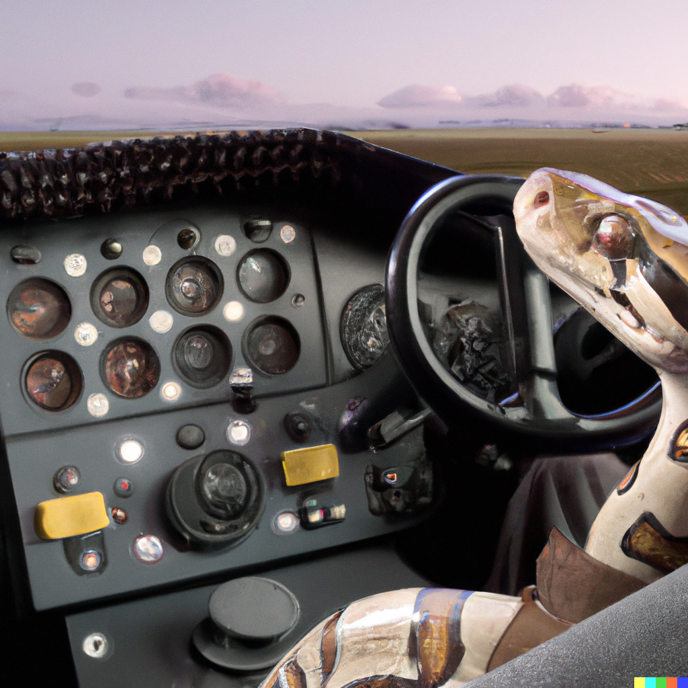
  </a>
  <figcaption style="font-style: italic; text-align: center;">Flying planes with Python, you say?<br><sub>(image created by Dall-E)</sub></figcaption>
</figure>

To allay any concerns: this will not be actually running Python or JavaScript software in the cockpit of a real aircraft in order to effect automated flight: that would kill people. Instead, we're writing a web page that can control an autopilot running in Python that in turn controls a little virtual aeroplane. And by "little" I actually mean "any aeroplane in [Microsoft Flight Simulator](https://www.flightsimulator.com/)" because as it turns out, MSFS comes with an API that can be used to both query _and set_ values ranging from anything as simple as cockpit lights to something as complex as spawning a fleet of aircraft and making them perform formation flights while making their smoke pattern spell out the works of Chaucer in its original middle English.

While we're not doing that (...today?), we _are_ going to write an autopilot for planes that don't have one, as well as planes that do have one but that are just a 1950's chore to work with, like the one in my favourite real-life plane, the [DeHavilland DHC-2 "Beaver"](https://en.wikipedia.org/wiki/De_Havilland_Canada_DHC-2_Beaver), originally made by the [de Havilland Aircraft Company](https://en.wikipedia.org/wiki/De_Havilland) , but these days made by [Viking Air](https://www.vikingair.com/viking-aircraft/dhc-2-beaver) (which is amazing and fantastic and they are true aviation heroes). Specifically, the float plane version, which flies between [Vancouver](https://www.openstreetmap.org/relation/2218280) and [Vancouver Island](https://www.openstreetmap.org/relation/2249770), as well as locations dotted around the [Strait of Georgia](https://www.openstreetmap.org/relation/13321885). I don't have a pilot's license, but the nice thing about tiny flights is that you regularly get to sit in the copilot seat, and enjoy beautiful British Columbia from only 300 meters up in the air.

<figure style="width: 40%; margin: auto; margin-bottom: 1em;" >
  <a href="https://harbourair.com/flight-info/flight/locations" target="_blank">
    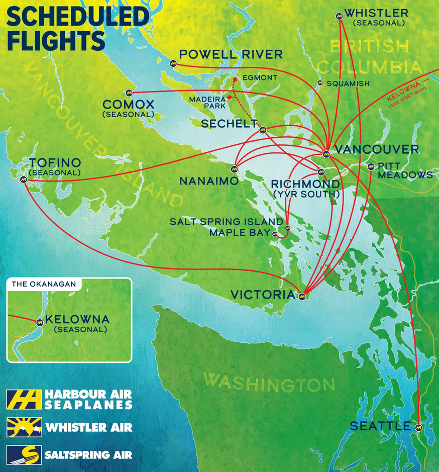
  </a>
  <figcaption style="font-style: italic; text-align: center;">In case anyone is visiting Vancouver...<br><sub>(Map owned by <a href="https://harbourair.com/">Harbour Air</a>)</sub></figcaption>
</figure>

But back to Python and JavaScript: MSFS comes with an SDK called the [SimConnect SDK](https://docs.flightsimulator.com/html/Programming_Tools/SimConnect/SimConnect_SDK.htm) that lets people write addons for the game using C, C++, or languages with .NET support, and so of course folks have been writing connectors in those languages to "proxy" the SimConnect calls to officially unsupported languages like Go, Node, Python, etc.

Since the idea is to interface with MSFS from a webpage, and webpages use JS, my first thought was "cool, I can write an express server that connects to MSFS?" to which the answer unfortunately is no. At least not directly. The `node-simconnect` package is rather incomplete, and so rather than using Node to interface with MSFS, we reach for the next best thing: [python-simconnect](https://pypi.org/project/SimConnect/). Sure, we now need two languages, but they're both fairly easy to work with so why not.

Using `python-simconnect`, we can write a tiny Python webserver with `GET` calls for querying MSFS, and `POST` calls for setting values in-sim, and then our webpage can just use [the Fetch API](https://developer.mozilla.org/en-US/docs/Web/API/Fetch_API/Using_Fetch) to talk to our Python server for all its needs. Although it turns out that even `python-simconnect` is incomplete (although far less so than `node-simconnect`), so we're actually using [a fork I made](https://github.com/Pomax/Python-SimConnect/tree/edits) that makes some improvements we need to in order to tell apart all the different states that MSFS can be in, as well as adding a few missing sim variables, renaming some that had the wrong name, and fixing some that had the wrong editable flag set.

So let's get coding!

### A simple Python API server

Let's write a simple Python script that sets up a "SimConnection" object (which will handle all the MSFS connector logic), a `GET` route for getting values out of MSFS, and a `POST` route for setting values in MSFS. First, we'll create a virtual environment to work with, and install the SimConnect fork:

```bash
C:\Users\You\Documents\are-we-flying\> python -m venv venv
C:\Users\You\Documents\are-we-flying\> venv\Scripts\activate
(venv) C:\Users\You\Documents\are-we-flying\> python -m pip install git+https://github.com/pomax/python-simconnect@master#egg=simconnect
```

Then we create a `server.py` file:

```python
import json
from http.server import BaseHTTPRequestHandler, HTTPServer
from urllib.parse import parse_qs, urlparse
from SimConnect import SimConnection

host_name = "localhost"
server_port = 8080
sim_connection = None

class ProxyServer(BaseHTTPRequestHandler):
  def set_headers(self):
    self.send_response(200)
    self.send_header('Access-Control-Allow-Origin', '*')
    self.send_header('Cache-Control', 'no-cache')
    self.send_header('Content-type', 'application/json')
    self.end_headers()

  def log_request(self, code='-', size='-'):
    # We don't want to see every GET and POST, there's going to
    # be way too many. We just want to see requests with errors.
    return

  def do_GET(self):
    self.set_headers()

    # If we don't have MSFS running, there is no point in trying
    # to do anything on a GET request: we have no connection to the sim.
    if not sim_connection.connected:
      return self.wfile.write(json.dumps(None).encode('utf-8'))

    # If we get here, we know MSFS is running, so we can add
    # a special route that can be fetch()ed to check that fact.
    if '/connected' in self.path: data = True

    # for any other route, we treat it as API call.
    else: data = self.get_api_response()

    # and then we send our data as http response, making sure the
    # response is never empty.
    if data != None: data = json.dumps(data).encode('utf-8')
    else: data = "{}"
    self.wfile.write(data)

  def do_POST(self):
    self.set_headers()
    # Just so we don't have to bother with POST payloads, we use plain
    # name=val URL parameters for all our value-setting needs.
    data = False
    query = urlparse(self.path).query
    if query != '':
      (prop, value) = query.split("=")
      # We do want to make sure that any spaces are made safe, though:
      prop = prop.replace("%20", "_")
      data = sim_connection.set(prop, value)
    self.wfile.write(json.dumps(data).encode('utf-8'))

  def get_api_response(self):
    key_values = None
    query = parse_qs(urlparse(self.path).query)
    if 'get' in query:
      # If there's a get=name1,name2,... in the URL, split those names and
      # get the value for each name from MSFS:
      props = [s.replace("%20", "_") for s in query['get'].split(",")]
      for prop in props:
        key_values[prop] = sim_connection.get(prop)
    return key_values

def run():
  global sim_connection
  sim_connection = SimConnection()
  sim_connection.connect()

  try:
    webServer = HTTPServer((host_name, server_port), ProxyServer)
    print(f'Server started on http://{host_name}:{server_port}')
    webServer.serve_forever()
  except KeyboardInterrupt:
    sim_connection.disconnect()
    webServer.server_close()
    print('Server stopped.')

if __name__ == "__main__":
  run()
```

With that part covered, we can start writing a webpage that talks to MSFS through our Python server!

## A handy web page

We'll start with a bare bones `index.html` web page, just enough to get us going, which we'll stick in a `website\public` dir:

```html
<!DOCTYPE html>
<html>
  <head>
  <meta charset="utf-8" />
  <title>Are we flying?</title>
  <link rel="stylesheet" href="style.css" />
  <script src="index.js" async defer></script>
  </head>
  <body>
  <h1>Are we flying?</h1>
  <ul id="questions">
    <!-- we'll fill this in later... -->
  </ul>
  <div id="map">
    <!-- we'll fill this in later, too... -->
  </div>
  </body>
</html>
```

With a foreshadowing stylesheet `website\public\style.css`:

```css
#plane-icon {
  --deg: 0;
}
```

And a trivial `website\public\index.js` file:

```javascript
// look at all this empty space! O_O
```

We'll fill in the rest as we go along. But we do need a server to use this web page, because while you _can_ just load an .html file directly in the browser, anything network related (including certain relative file loads) just flat out won't work properly. So: **never use `file:///`, always load web pages from a url**.

A simple rule to follow, especially with Python installed. `python -m http.server` and presto: we have a web server running on http://localhost:8080

## Setting up a simple web server

Having said that, `python -m http.server` won't cut it in this case, because we want to serve up content _and_ proxy any API calls to our python server in a way that won't let folks just snoop on our IP... We don't want our webpage to actually know where the python server lives, instead we want it to be able to just call `/api/....` on itself and magically have that work.

>  ***"Hold up, why would we do this?"*** *- you, hopefully*

That's a good question: web pages can run just about anywhere, but in order for our python server to work with MSFS, we need to have it run on our own computer. That comes with risks: we don't want other people to be able to just look at their browser's network tab and copy our IP address to then do all kinds of fun things with. Perhaps I should put fun in quotes. Those things tend to not be fun at all.

Instead, we only want people to be able to see the IP address of the web server that's serving up our web page, and have the web page communicate only with that server. We can then make the web server talk to _our_ computer on the "server side". That's one extra step, but now people can't just trivially find our IP and do questionable things.

To that effect, we're going to set up a simple Node.js [express server](https://expressjs.com/), mostly because it has an almost trivial way to set up a proxy to another server for a specific route, using `express-http-proxy`. So first up, let's make a `website` dir, and install the necessary dependencies in there:

```
C:\Users\You\Documents\are-we-flying\website\> npm install express express-http-proxy open
```

And then we create our `website\server.js`:

```javascript
import express from "express";
import proxy from "express-http-proxy";

const app = express();
const WEB_SERVER_PORT = 3000;
const API_SERVER_URL = `http://localhost:8080`;

// Some housekeeping: disallow all server and browsers caching
app.disable("view cache");
app.set("etag", false);
app.use((_req, res, next) => {
  res.set("Cache-Control", "no-store");
  next();
});

// Then, make sure static html, css, and js content all gets served with the correct mime type:
app.use(
  express.static("public", {
    setHeaders: (res, path, stat) => {
      let contentType = `application/octet-stream`;
      if (path.endsWith(`.js`)) contentType = "application/javascript";
      else if (path.endsWith(`.css`)) contentType = "text/css";
      else if (path.endsWith(`.html`)) contentType = "text/html";
      res.setHeader("Content-Type", contentType);
    },
  })
);

// Proxy GET and POST requests to the `/api` route directly to our python server instead:
app.post(`/api`, proxy(API_SERVER_URL));
app.get(`/api`, proxy(API_SERVER_URL));

// ...and redirect the root URL to index.html, something we all expect.
app.get(`/`, (_req, res) => res.redirect(`/index.html`));

// Then with all that: start up the server!
app.listen(WEB_SERVER_PORT, () => {
  console.log(`Server listening on http://localhost:${WEB_SERVER_PORT}`);
  if (!process.argv.includes(`--no-open`)) {
    open(`http://localhost:${WEB_SERVER_PORT}`);
  }
});
```

With both these things set up, we can start filling out our web page with actually interesting information.

### Are we flying?

Let's start by just checking whether we're even flying a plane in MSFS at all. After all, if we're not flying, there's nothing to add an autopilot to either.

We'll need to check a few things:

1. Is the API server running?
2. Is MSFS running?
3. Are we "playing" instead of navigating the menus or having the game paused?
4. If all the above are true, what are the various bits of flight information that we can visualize, like speed, altitude, etc.?

<figure style="width: 90%; margin: auto; margin-bottom: 1em;" >
  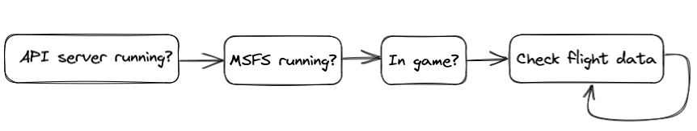
  <figcaption style="font-style: italic; text-align: center;"></figcaption>
</figure>

So let's update our `index.html` with those states:

```html
<ul id="questions">
  <li>is the API server running? <span id="api-running">not yet</span></li>
  <li>is MSFS running? <span id="msfs-running">not yet</span></li>
  <li>are we in-game? <span id="in-game">not yet</span></li>
  <li>are we flying? <span id="flying">not yet</span></li>
</ul>
```

With then let's start filling our `index.js` to match:

```javascript
const API_URL = `http://localhost:8080`;

function getAPI(...propNames) {
  // a handy little API helper
  return fetch(`${API_URL}/?get=${propNames.join(`,`)}`).then(r => r.json());
}

function find(qs) {
  // I don't want to write "document.querySelector" everywhere,
  // so I always have a find(...) in my plain JS projects.
  return document.querySelector(qs);
}

// Step 1: is the API server running?
function checkForServer() {
  fetch(API_URL).then(() =>
    find(`.api-running`).textContent = `yes!`;
    checkForMSFS();
  )
  // If the fetch failed, try it again one second from now.
 .catch(() => setTimeout(checkForServer, 1000));
}

// Step 2: is MSFS running?
async function checkForMSFS() {
  const connected = await fetch(`${API_URL}/connected`);
  if (connected === true) {
    find(`.msfs-running`).textContent = `yes!`;
    return checkForPlaying();
  }
  // if the API server is up, but MSFS isn't running,
  // check again one second from now.
  setTimeout(checkForMSFS, 1000);
}

// Step 3: are we in-game?
async function checkForPlaying() {
  // we'll add this code in the next section!
}
```

### Let's test this!

Let's create a little `run.bat` so we can run one command to start up both the python server and our express server, and then automatically open the browser to show us our page:

```powershell
@echo off
start "" cmd /k "cd venv\Scripts & activate & cd ..\..\api & title Autopilot & python server.py"
start "" cmd /k "cd website & title Webserver & node server.js"
```

If we have MSFS running we can now run `C:\Users\You\Documents\are-we-flying\run` and this will start two Windows command prompts, one running our python API server in a virtual environment, and one running our Express webserver, automatically opening your browser to the webserver's local URL.

### Next: are we in-game?

So: so far, so good. We can check for the server, because the network request fails if it's not up, and we can check for whether it's connected to MSFS once the server is up, but then we hit a snag.

It turns out MSFS has no good way to tell you whether someone's actually in game or not. That is to say, rather than offering an easy to query variable, Microsoft designed the SimConnect SDK with in-game addons in mind, so it expects your code to start up _with_ MSFS, registering an event listener on startup, so that your code can get notified about state transition events.

This is not super useful if we start up our API server late, or after we already started flying. We're obviously not going to be able to use that part of the SimConnect SDK: we have to come up with something different. So, to make things a little easier, I updated my fork of `python-simconnect` to have a special variable that's not part of the official SimConnect SDK itself: `SIM_RUNNING`, which is an `int.int` formatted value. The integer part of the number is one of 0, 1, 2, or 3, where the value 3 means we're playing the game, 2 means we're in game but we paused the game, and 1 or 0 tells us we're navigating the menu system out-of-game or are in game state transition screens (like the loading screen after picking a plane and departure point on the world map). The decimal fraction part of the number represents the current game camera angle (a number between 2 and 25) which we can use to determine whether we're legitimately flying the plane, or whether we're in [slew mode](https://www.flightsim.com/vbfs/showthread.php?286073-What-the-heck-is-quot-slew-quot-mode) or checking out our plane using the special [drone camera](https://forums.flightsimulator.com/t/how-to-using-the-drone-cam-tips-tricks/128165), etc.

So let's query the python server for that variable!

```javascript
// Step 3: are we in-game?
async function checkForPlaying() {
  const { SIM_RUNNING: runFlag } = await getAPI(`SIM_RUNNING`);
  if (runFlag >= 3) {
    find(`.in-game`).textContent = `yes!`;
    return waitForEngines();
  }
  // If we're not in game, check again one second from now.
  setTimeout(checkForPlaying, 1000);
}

// Step 4: preflight check... are the engines running?
async function waitForEngines() {
  // we'll add this code in the next section!
}
```

And that's all we need: run this function until the `SIM_RUNNING` value is `3.something` and then call the function that starts our real code.

### Are the engines running?

Of course, just because we're in-game doesn't mean we're actually flying yet: some people like to jump into the game with the plane ready to go, but others like to play for realism and start with the plane parked, "cold and dark", meaning nothing's turned on and you need to wait just as long as in real life before you can actually start flying.

To check for this, we query MSFS for the following values first:

1. `ENGINE TYPE`: This tells us what kind of engine we have, bearing in mind that the answer _might_ be "this aircraft has no engines" (because gliders are a thing!).
2. `ENG_COMBUSTION:1`, `ENG_COMBUSTION:2`, `ENG_COMBUSTION:3`, and `ENG_COMBUSTION:4`: separate engine indicators.

Planes can have up to four engines (... in MSFS) so these four values let us see whether any of them are fired up or not. Because remember: just because a plane has four engines, doesn't mean we're using all of them. With these values, we can "wait" with reporting all the other flight data until we know the plane's "working" (unless it's a glider, which has no engines, in which case we can just skip straight to flight monitoring).

```javascript
const ENGINE_DATA = [`ENGINE_TYPE`, `ENG_COMBUSTION:1`, ... , `ENG_COMBUSTION:4`]

// Step 4: preflight check... are the engines running?
async function waitForEngines() {
  const data = await getAPI(...ENGINE_DATA);
  if (data.ENGINE_TYPE === 2) {
    // this is the "this plane has no engines" value!
    find(`.flying`).textContent = `yes!`;
    return startMonitoringFlightData();
  }
  const enginesRunning = [1,2,3,4].some(id => data[`ENG_COMBUSTION:${id}`]));
  if (enginesRunning) {
    find(`.flying`).textContent = `yes!`;
    return startMonitoringFlightData();
  }
  // If the plane's not running, check again one second from now.
  setTimeout(waitForEngines, 1000);
}

// Step 4b: start monitoring flight data
async function startMonitoringFlightData() {
  // we'll add this code in the next section!
}
```
And with that, we can move on to our "flight analysis":

### What's the plane doing?

There's a whole bunch of parameters we can query MSFS for, so here are the ones we're going to be interested in (with the more elaborate documentation found on the MSFS SimConnect [Simulation Variables](https://docs.flightsimulator.com/html/Programming_Tools/SimVars/Simulation_Variables.htm) page):

| varname | description |
| ---- | ---- |
| AILERON_TRIM_PCT | How much the plane's been set to lean, in order to counteract things like the propeller pulling the plane left or right. |
| AIRSPEED_TRUE | How fast the plane is flying, in knots (1kts being 101.269 feet per minute) |
| AUTOPILOT_MASTER | Is the built-in autopilot on? (if there is one!) |
| ELEVATOR_TRIM_POSITION | How much the plane's been set to pitch, in order to counteract things like weight distribution and airspeed making the plane tilt up or down. |
| GPS_GROUND_TRUE_TRACK | The heading our plane is flying in, which is _not_ always the heading our plane is _pointing_ in (thanks, cross wind). |
| GROUND_ALTITUDE | How high the ground underneath us is with respect to sea level, in feet. |
| INDICATED_ALTITUDE | How high the plane claims it's flying, in feet (which might be wrong!) |
| PLANE_ALT_ABOVE_GROUND | How high above the ground we are, in feet. |
| PLANE_BANK_DEGREES | How much we're pitching left or right, in radians. |
| PLANE_HEADING_DEGREES_MAGNETIC | The compass heading that the plane thinks it's pointing at, in radians. |
| PLANE_HEADING_DEGREES_TRUE | The heading we're _actually_ pointing at (magnets... how do they even work??) |
| PLANE_LATITUDE | Our north/south GPS coordinate. |
| PLANE_LONGITUDE | Our east/west GPS coordinate. |
| PLANE_PITCH_DEGREES | How much the plane is pitching up or down, in radians. (But because of how flight works, the plane pitching up does not necessarily mean we're actually _moving_ up). |
| SIM_ON_GROUND | This tells us whether the plane is on the ground or in the air. |
| STATIC_CG_TO_GROUND | The distance from our plane's center of gravity (CG) to the actual ground. |
| TITLE | The make and model of our plane. |
| TURN_INDICATOR_RATE | How many degrees per second our plane's heading is changing. |
| VERTICAL_SPEED | The speed at which we're either gaining or losing altitude, in feet per minute. |

We can do a lot with these values! Let's poll the server for them every second, and then process the data we get back:

```javascript
let cachedData;
const FLIGHT_DATA = [`AILERON_TRIM_PCT`, `AIRSPEED_TRUE`, ... , `VERTICAL_SPEED` ]

const { PI } = Math;
const TAU = 2 * PI;
const degrees = v => 360 * v/TAU;

// Step 4b: start monitoring flight data
async function startMonitoringFlightData() {
  // Start our "main loop" for polling and then processing flight data
  setInterval(() => {
    const flightData = await getAPI(...FLIGHT_DATA);
    update(flightData);
  }, 1000);
}

async function update(data) {
  cachedData = data;

  // Get our orientation information
  const orientation = {
    airBorn: data.SIM_ON_GROUND === 0 || this.vector.alt > this.vector.galt + 30,
    heading: degrees(data.PLANE_HEADING_DEGREES_MAGNETIC),
    trueHeading: degrees(data.PLANE_HEADING_DEGREES_TRUE),
    turnRate: degrees(data.TURN_INDICATOR_RATE),
    pitch: degrees(data.PLANE_PITCH_DEGREES),
    trim: data.ELEVATOR_TRIM_POSITION,
    aTrim: data.AILERON_TRIM_PCT,
    bank: degrees(data.PLANE_BANK_DEGREES),
    yaw: degrees(data.PLANE_HEADING_DEGREES_MAGNETIC - data.GPS_GROUND_TRUE_TRACK),
  };

  // And some flight details
  const details = {
    lat: data.PLANE_LATITUDE,
    long: data.PLANE_LONGITUDE,
    speed: data.AIRSPEED_TRUE,
    vspeed: data.VERTICAL_SPEED,
    alt: data.INDICATED_ALTITUDE,
    palt: data.PLANE_ALT_ABOVE_GROUND - data.STATIC_CG_TO_GROUND,
    galt: data.GROUND_ALTITUDE,
    title: data.TITLE,
  };

  doCoolThingsWithOurData(orientation, details);
}

async function doCoolThingsWithOurData(orientation, details) {
  // Let's do some cool things with our data here!
}
```

We can now start writing whatever we like in our `doCoolThingsWithOurData(vector, orientation)` function, like drawing our plane on a map, or showing a web version of the plane's cockpit dashboard.

### What's the plane doing, where?

In order to make sure we know what our autopilot will be doing (remember, that was our original intent!) let's draw our plane on a map using the [Leaflet](https://leafletjs.com/) library and plot some of the flight data in a graph, to give us some insight into what's happening:

```javascript
// Leaflet creates a global "L" object to work with.
const DUNCAN_AIRPORT = [48.756669, -123.711434];

// Set up leaflet to tie into the <div id="map"></div> we have sitting in our index.html:
const map = L.map("map").setView(DUNCAN_AIRPORT, 15);

// Using OpenStreetMap tiles for our map:
L.tileLayer(
  `https://tile.openstreetmap.org/{z}/{x}/{y}.png`, {
  maxZoom: 19,
  attribution: `© <a href="https://www.openstreetmap.org/copyright">OpenStreetMap</a>`,
  }
).addTo(map);

// With a little plane icon that we can use to show where we are:
const plane = L.marker(DUNCAN_AIRPORT, {
  icon: L.divIcon({
  html: ``
  }),
}).addTo(map);

async function doCoolThingsWithOurData(orientation, details) {
  // Cool thing 1: update the map to show where we are
  const { lat, long } = details;
  const pair = [lat, long];
  map.setView(pair);
  plane.setLatLng(pair);
}
```

With this code we have a map that shows our plane and updates our plane location as we're flying, making sure to center the map on its new location.

<figure style="width: 60%; margin: auto; margin-bottom: 1em;" >
  <a href="duncan-bad.png" target="_blank">
    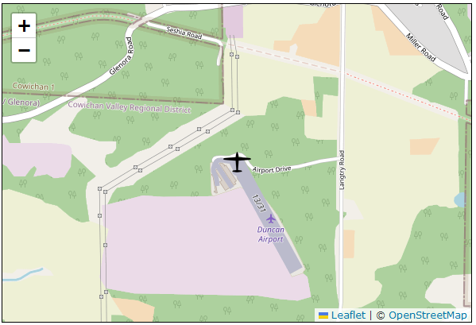
  </a>
  <figcaption style="font-style: italic; text-align: center;">This is not ideal...</figcaption>
</figure>


But, uh, it will look wrong pretty much all the time because the plane isn't facing the right direction... So let's fix that with some CSS:

```css
#plane-icon {
  --deg: 0;
  --icon-width: 100px;
  --icon-height: 100px;
  --w: calc(var(--icon-width) / 2);
  --h: calc(var(--icon-height) / 2);
  position: relative;
  top: calc(0 - var(--w));
  left: calc(0 - var(--h));
  transform-origin: var(--w) var(--h);
  transform: rotate(1deg * var(--deg));
}
```

and update our JS accordingly:

```javascript
function doCoolThingsWithOurData(orientation, details) {
  // Cool thing 1: update the map to show where we are
  const { lat, long } = details;
  const pair = [lat, long];
  map.setView(pair);
  plane.setLatLng(pair);

  // Cool thing 1.1: with the plane pointing the right way...
  const { heading } = orientation;
  const planeIcon = document.getElementById(`#plane-icon`);
  planeIcon.style.setProperty(`--deg`, heading | 0));
  // Note that `... | 0` converts numbery things to 32 bit integers,
  // while conveniently turning anything that isn't a number into 0.
}
````

Now our plane will not just be pinned in the right place, but it'll also facing the right direction:

<figure style="width: 60%; margin: auto; margin-bottom: 1em;" >
  <a href="duncan.png" target="_blank">
    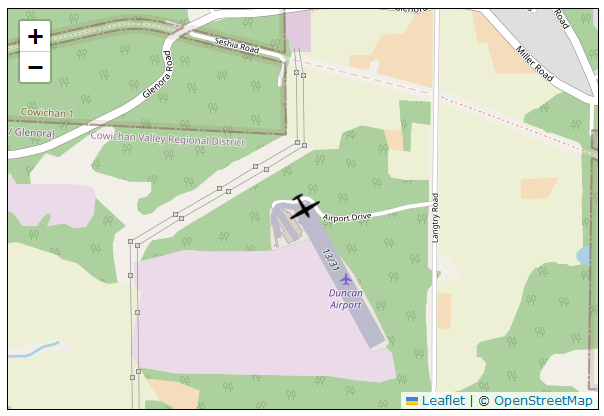
  </a>
  <figcaption style="font-style: italic; text-align: center;">Waiting for take-off at Duncan airport!</figcaption>
</figure>
### What's our plane doing... but in scientific detail!


That just leaves graphing some flight information every time the `doCoolThingsWithOurData` function runs. The easiest plotting framework is actually built right into HTML: SVG. All we need to do is track `<path>` elements that we add new values to every time there's new data. Rather than spend time on how to write that code, I'm just going to drop [this link](https://gist.github.com/Pomax/de7707ae17c76caae4dabf7806dbd816) here, which is our entire grapher in less than 250 lines of code. Mixing that in:

```javascript
import { setupGraph } from "./svg-graph.js";
let graph;

// Step 4b: start monitoring flight data
async function startMonitoringFlightData() {
  // set up our graph before we start listening for flight data...
  graph = setupGraph(document.body, 600, 400);
  graph.setProperties({
      label: `ground`,
      min: 0,
      max: 5000,
      fill: {
        baseline: 0,
        color: `saddlebrown`,
      }
    }, {
      label: `altitude`,
      min: 0,
      max: 5000,
    },{
      label: `vspeed`,
      limit: 1500,
    },
    ...
  );
  graph.start();

  // ...then start our "main loop" for polling and then processing flight data
  setInterval(() => {
    const flightData = await getAPI(...FLIGHT_DATA);
    update(flightData);
  }, 1000);
}

async function doCoolThingsWithOurData(vector, orientation) {
  const { alt, galt, vspeed } = vector;
  const { heading, pitch, bank, yaw, trim } = orientation;

  // Cool thing 2: do a science vizualizer!
  graph.addValue(`vspeed`, vspeed);
  graph.addValue(`bank`, bank);
  graph.addValue(`trim`, trim);
  graph.addValue(`pitch`, pitch);
  graph.addValue(`altitude`, alt);
  graph.addValue(`ground`, galt);
}
```

And there we go:

<figure style="width: 60%; margin: auto; margin-bottom: 1em;" >
  <a href="graphing.png" target="_blank">
    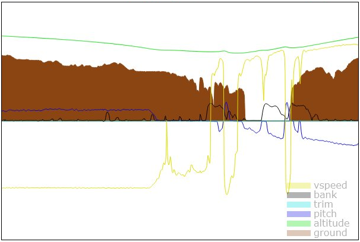
  </a>
  <figcaption style="font-style: italic; text-align: center;">So much information...</figcaption>
</figure>


We're now finally ready to not just write our autopilot, but also see what it's doing, which is crucially important to understanding what your code's doing... Or doing wrong.

## Creating an autopilot

For making our autopilot, we're actually going to switch languages back to Python. Don't get me wrong: we _could_ write our autopilot in JS, but we'd much rather not have to deal with the delay of network requests from JS to our Python API server, or the irregular timing of a `setInterval` or `setTimeout` (which is only guaranteed to wait _at least_ the indicated number of milliseconds, it does not guarantee that it will actually fire once the indicated number of milliseconds have passed. Important lesson to learn!).

In this case, in order to make sure our code runs fast, and can run at a high speed, steady interval, it's much easier to work in Python. After all, it's talking directly to MSFS. As such, we're going to extend our little python server to do a bit more: it's going to accept autopilot _instructions_ from a web page, but it'll run the autopilot _logic_ itself. We're going to create an `Autopilot` class that will house all the logic, and we'll update our `do_GET` and `do_POST` code to route anything that comes in for `/autopilot` to that class:

```python
...

from autopilot import Autopilot
auto_pilot = None

def do_GET(self):
  ...

  # Is MSFS even running?
  if '/connected' in self.path:
  data = True

  # Is our python-based autopilot running?
  if '/autopilot' in self.path:
    data = json.dumps(auto_pilot.get_state())

  ...

def do_POST(self):
  ...

  self.set_headers()

  # is this an autopilot instructions?
  if '/autopilot' in self.path:
    global auto_pilot
    if query == '':
      ap_state = auto_pilot.toggle_autopilot()
      result = {'AP_STATE': ap_state}
    else:
      query = parse_qs(query)
      ap_type = query['type'][0]
      ap_target = query['target'][0] if 'target' in query else None
      if ap_target is not None:
        value  = float(ap_target) if ap_target != 'false' else None
        ap_state = auto_pilot.set_target(ap_type, value)
      else:
        ap_state = auto_pilot.toggle(ap_type)
      result = {'AP_TYPE': ap_type, 'AP_STATE': ap_state}
    return self.wfile.write(json.dumps(result).encode('utf-8'))

  ...

def run():
  global auto_pilot, sim_connection
  sim_connection = SimConnection()
  sim_connection.connect()
  auto_pilot = AutoPilot(sim_connection)

  ...
```

You can see that there's going to be three important functions:

- `autopilot.get_state()` which will give us a JSON readback of the various settings in our autopilot:

  - ```python
    def get_state(self):
      state = {'AP_STATE': self.auto_pilot_enabled}
      for key, value in self.modes.items():
        state[key] = value
      return state
    ```

- `autopilot.set_target()` which lets us set an autopilot property to a specific value:

  - ```python
    def set_target(self, ap_type, value):
      if ap_type in self.modes:
        self.modes[ap_type] = value if value != None else False
        return value
      return None
    ```

- and `autopilot.toggle()` which lets us toggle an autopilot feature from on to off, or off to on:

  - ```python
    def toggle(self, ap_type):
      if ap_type not in self.modes:
        return None
      self.modes[ap_type] = not self.modes[ap_type]
      return self.modes[ap_type]
    ```


With that out of the way: how do we implement the actual autopilot?

## So how does an autopilot actually work?

At its core, an autopilot is a system that lets a plane fly "in a straight line". However, there are two different flavours of "straight line" we need to think about, because we're not driving on a road, or gliding across water, we're flying through the air:

1. we can fly in a straight line without tipping left or right, and
1. we can fly in a straight line without pitching up or down.

The first of these is achieved using, in autopilot parlance, **level mode**, and the second using **vertical hold**. You can see where the names come from: the first keeps the plane's wings level, (roughly!) keeping us pointing in the same compass direction, while the second keeps the plane at (again, roughly!) some fixed altitude.

More fully featured autopilots extend these two modes by adding **altitude hold**, which effectively runs vertical hold "at (roughly!) a _specific_ altitude", with additional logic to get us from one altitude to another if we need to change that, as well as by adding **heading mode**, which effectively runs level mode "for (again, roughly!) a _specific_ compass direction", again with additional logic to get us from one direction to another if we need to change that.

We start by observing that we _could_ try to take all our aeroplane's flight data, then run a bunch of maths on the numbers we get in order to predict when we need to perform which operations in order to make sure that our plane does the right thing, but this will be a losing proposition: the weather, air density changes, random updrafts, terrain-induced wind, etc. is all going to interfere with any predictions we'd make. Thus explaining all the "roughlies" you saw peppered throughout the previous paragraph.

Instead, we're going to implement our autopilot as a _reactionary_ system: it looks at what the current flight data is, and then puts in small corrections that'll push us away from the wrong direction, and we repeat that process over and over and over, every time looking at the new flight data, and then saying which new corrections to make. The trick to getting an autopilot working based on this approach is that if we can do this in a way that makes the corrections smaller and smaller every time we run, we will converge on the desired flight path, barely having to correct anything after a while. The plane will just be flying the way we want it to.

Of course, a real autopilot does this kind of monitoring and correcting on a continuous basis. Something we don't really have the luxury of doing by using Python: in order not to overload both Python and MSFS, we can really only run our code few times per second, so let's pick something that we as humans can understand: we're going to run our code twice per second. That means our autopilot's going to be pretty coarse! ...and yet, we'll be able to make it work, because

### The backbone of our Autopilot code: constrain-mapping

Before we do anything else, let's first look at what is probably _the_ single most important function in our autopilot: `constraint_map`. This function takes a value, relative to some interval `[a,b]`, and maps it to the corresponding value in a different interval `[c,d]`, such that `a` maps to `c`, `b` maps to `d`, anything in between `a` and `b` is some new value between `c` and `d`, but crucially, any value less than `a` still maps to `c` and any value greater than `b` still maps to `d`:

<figure style="width: 80%; margin: auto; margin-bottom: 1em;">
  <a href="constraint_map.png" target="_blank">
    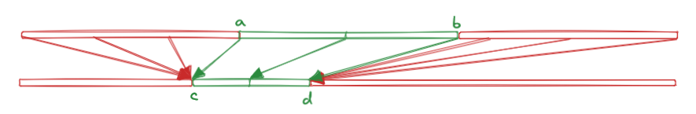
  </a>
  <figcaption style="font-style: italic; text-align: center;">Mapping interval [a,b] to [c,d]<br></figcaption>
</figure>
And that last part is critically important: if we're going to write an autopilot, we want to be able to effect proportional changes, but we want to "cap" those changes to some minimum and maximum value because just yanking the plane in some direction so hard that it stalls is the opposite of useful.

As such, let's implement `map`, `constrain`, and then put them together into a `constrain_map`:

```python
def map(v, a, b, c, d):
  l1 = (b-a)
  if l1 == 0:
    return (c + d) / 2
  l2 = (d-c)
  return c + (v-a) * l2/l1

def constrain(v, min, max):
  if min > max:
    return constrain(v, max, min)
  return max if v > max else min if v < min else v

def constrain_map(v, a, b, c, d):
  return constrain(map(v, a, b, c, d), c, d)
```

And then just because this is also going to be important: when we're mapping from some interval "around zero" (for example, between `-max_bank` and `max_bank`) to another interval "around zero" (for example, between `-step_size` and `step_size`), there will be cases where we don't actually want zero itself. For instance, if we need to nudge an aircraft left a little, based on how close it is a target heading, we don't want the correction to become so close as to basically do nothing, just because we're getting close to a target heading. As such, we're going to extend `constraint_map` with one an optional "forbidden" zone:

<figure style="width: 80%; margin: auto; margin-bottom: 1em;">
  <a href="constraint_map_limited.png" target="_blank">
    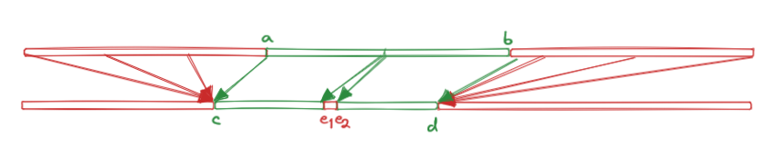
  </a>
  <figcaption style="font-style: italic; text-align: center;">Mapping interval [a,b] to [c,d] with a dead zone<br></figcaption>
</figure>

For which the code gets the following update:

```python
def constrain_map(v, a, b, c, d, e1=None, e2=None):
    val = constrain(map(v, a, b, c, d), c, d)
    # Is there a "forbidden interval"?
    if e1 is None or e2 is None:
        return val
    # Is this a normal value?
    if val < e1:
        return val
    if val > e2:
        return val
    # value in the "forbidden interval"?
    mid = (e1 + e2) / 2
    if val > e1 and val <= mid:
        return e1
    if val < e2 and val >= mid:
        return e2
    # while we can't really get here, you always want to specify what should happen anyway.
    return val
```

We're going to rely on this function _a lot_, so now that we know what it does, and how it does it, let's move on to actual autopilot code.

### Implementing Level Mode

For level mode, this means we're going to simply check "is the plane tilting left or right?" and if so, we move the **aileron trim**—a value that "biases" the plane to tilt left or right—in the opposite direction. As long we do that for long enough, we'll eventually have the plane flying nice and steady. You can think of this as "moving the center of gravity" of the plane (even though of course that's not what's really happening), so let's write some code.

```python
class Autopilot:
  def __init__(self):
    self.anchor = Vector(0, 0, 0)

  def toggle(self, ap_type):
    if self.modes[ap_type]:
      if ap_type == LEVEL_MODE:
        self.anchor.y = self.get('ELEVATOR_TRIM_POSITION')

  def fly_level(self, state):
    anchor = self.anchor

    # how much are we banking, and what's our maximum permissible bank?
    bank = degrees(state.bank_angle)
    max_bank = 15

    # how much is our bank accelerating, and what's that max permissible value?
    dBank = state.dBank
    max_dBank = radians(1)

    # A reasonably "safe" step size for updating our aileron trim
    step = radians(1)

    # For level flight, our target bank is zero degrees:
    target_bank = 0
    diff = target_bank - bank

    # Push us closer towards our target bank:
    anchor.x += constrain_map(diff,
      -max_bank, max_bank,
      -step, step,
      -0.05 * step, 0.05 * step
    )

    # And then also push us towards a bank acceleration of zero:
    anchor.x += constrain_map(dBank,
      -max_dBank, max_dBank,
      -step/2, step/2
    )

    # Then update the aileron trim
    auto_pilot.api.set_property_value('AILERON_TRIM_PCT', anchor.x)
```

What are we doing here?

- first off, we're defining our "sky anchor". That's not a real thing, it's just a convenient way to model x, y, and z offsets for the purpose of trimming, and is really just a triplet of numerical values. We'll use `anchor.x` for our left/right trimming here, and `anchor.y` for pitch trimming later. (We _could_ use `anchor.z` for rudder trimming but that's not usually a thing outside of auto-landing and auto-take-off, and that's _well_ beyond the scope of the kind of autopilot we're making here =)
- Then, because some planes have explicit aileron trim controls, we want to make sure we don't "overwrite" the existing trim setting when we engage the autopilot, so we make sure to copy over the trim value into `anchor.x` when the user toggles level mode.
- We then implement our wing leveling code by solving two problems at the same time: **(1)** we want a **bank angle** (the angle of the wings with respect to level flight) of zero and **(2)** we want a bank acceleration of zero. So we start by actually getting our current bank and bank acceleration values, and defining our maximum allowed values.
- First, we correct our bank: if we're banking a lot, we want to correct a lot, and if we're banking a little, we want to correct just a little, but we always want to correct by at least a tiny amount. Which is exactly what we wrote `constraint_map` to do for us. We're going to, at most, correct the plane by 1 degree, if we're banking more than our `max_bank` value of 15 degrees, and at least correct by 1/20th of a degree.

 That might seem curious: where did those values come from? And unfortunately, MSFS doesn't actually have some "X degrees means 100% aileron" value that we can consult here, so we're effectively just using a best guess correction that works "well enough" for most planes based on just trying a whole bunch of them. It might not work for _all_ of them, but it works for a lot of them, and that's good enough for now.

- Second, we correct our bank acceleration by trimming opposite to the direction we're accelerating in. Note that this will also counteract that tiny "always trim a little by 1/20<sup>th</sup> of a step" that we left for the regular bank correction.
- Finally, we update our trim, and then we wait for the autopilot to trigger this function again so we can run through the same procedure, but with slightly less wrong values. Provided this function runs enough times, we'll converge on level flight, and that's exactly what we want.

### Implementing Vertical Hold

In order to achieve vertical hold, we're going to adjust our "elevator trim" (i.e. our pitch) rather than our aileron trim, by looking at the plane's vertical speed. That is, we're going to look at how fast the plane's moving up or down through the air, and then we try to correct for that by changing how much the plane is pitching forward or backward.

So, let's write some more code. First off, we cache the current trim again, because you typically pitch trim your plane before engaging autopilot:

```python
def toggle(self, ap_type):
  if self.modes[ap_type]:
    if ap_type == VERTICAL_SPEED_HOLD:
      self.anchor.y = self.get('ELEVATOR_TRIM_POSITION')
```

And then the vertical hold code

```python
def hold_vertical_speed(self, state):
  anchor = self.anchor

  # how much does this plane allow us to trim?
  trim_limit = state.pitch_trim_limit
  trim_limit = 10 if trim_limit == 0 else trim_limit
  trim_step = constrain_map(trim_limit, 5, 20, radians(0.001), radians(0.01))
  kick = 10 * trim_step

  # What is our current vertical speed, and its maximum permissible value?
  VS = state.vertical_speed
  max_VS = 1000

  # What is our current vertical acceleration, and its maximum permissible value?
  dVS = state.dVS
  max_dVS = 20

  # For stable flight, our target VS is zero:
  target_VS = 0

  # Determine the difference in vertical speed we need to overcome,
  # and use that to constrain our maximum allowed vertical acceleration.
  diff = target_VS - VS
  max_dVS = 1 + constrain_map(abs(diff), 0, 100, 0, max_dVS - 1)

  # Are we accelerating too much? Then we need to pitch in the opposite direction:
  if dVS < -max_dVS or dVS > max_dVS:
    anchor.y -= constrain_map(dVS, -10 * max_dVS, 10 * max_dVS, -kick, kick)

  # Also, if we're past safe vertical speeds, bring us back to safe speeds:
  if (VS < -max_VS and dVS <= 0) or (VS > max_VS and dVS >= 0):
    anchor.y += constrain_map(VS, -max_VS, max_VS, trim_step, -trim_step)

  # And then regardless of those two protection measures:
  # nudge us towards the correct vertical speed.
  anchor.y -= constrain_map(diff, -1000, 1000, -kick, kick)

  auto_pilot.api.set_property_value('ELEVATOR_TRIM_POSITION', anchor.y)
```

First, notice the `trim_limit` value: every aircraft has different pitch trim controls, and since MSFS only lets use set the "trim position" for pitch, we need to know what actual trim values correspond to "setting a maximum trim value".

For instance, the [Cessna 310R](https://en.wikipedia.org/wiki/Cessna_310) has a min/max trim value of 20, with 20 corresponding to 100% trim and -20 corresponding to -100% trim. We can thus use trim corrections values in increments of 1/1000 (corresponding to moving the trim by 0.1% each step) and have decent control. However, the [Britten-Norman Islander](https://en.wikipedia.org/wiki/Britten-Norman_BN-2_Islander) has a min/max trim of only 6, so if we just blindly used the same step values that we know work for the 310, we'd actually be trimming over three times as hard... that plane would basically be bouncing up and down in the air instead of converging on a steady vertical speed.

Also, some planes don't "officially" have trim, like the [Top Rudder 103 Solo](https://www.toprudderaircraft.com/) ultralight, and so their trim limit as reported by MSFS is simply zero... but _they can still be trimmed_ by explicitly setting trim values. So for those planes we just "guess": we set their trim limit to 10 and hope that's a reasonable number. There's not much else we can do.

So with that out of the way, the vertical hold approach consists of:

- correcting for any potential acceleration in the wrong direction, and
- correcting for any potential vertical overspeeding, then
- pushing the plane a bit in the right direction, and if we just keep doing that, eventually we'll end up in a situation where we're flying with "zero" vertical speed.

Of course,  that "zero" is in quotes because the air itself is always a factor (wind gusts, differences is air density, etc) but it'll be close enough to zero to keep us mostly flying at the same altitude (but _not_ necessary the altitude at which we turned on vertical hold!)

And... that's it. Again, not a lot of code, but it does what we need it to, updating our elevator trim so that we end up flying in a straight line. Combined with level mode, we're basically done! This is an autopilot!

There are a few more "magic numbers" that we can fiddle with here, just like before (and you totally should! Just.. not for days) but aside from fiddling and twiddling, this is it. We implemented an old school autopilot.

### Analysing our code so far

Writing code is well and good, but the proof is in the pudding: we're going to have to fly some planes and see what the graphs tell us, which means making sure we can toggle the autopilot code, so let's add some code to our `index.html`:

```html
<div id="autopilot">
  <button class="master">AP</button>
  <button class="LVL">level mode</button>
  <button class="VSH">vertical hold</button>
</div>
```

With some JS to hook into that in our `index.js`:

```javascript
const AP_URL = `http://localhost:8080/autopilot/`
const ap = document.getElementById(`autopilot`);
const callAP = (suffix=``) => fetch(AP_URL + suffix, { method: `POST` });
ap.querySelector(`.master`).addEventListener(`click`, () => callAP());
ap.querySelector(`.LVL`).addEventListener(`click`, () => callAP(`?type=LVL`));
ap.querySelector(`.VSH`).addEventListener(`click`, () => callAP(`?type=VSH`));
```

And now we can toggle our autopilot, level mode, and vertical hold mode from our web page, and then watch the graph evolve over time.

Let's start with the Top Rudder 103 Solo ultralight. This plane has a throttle, and a stick, and that's basically it, so what happens if we tell it that it actually has an autopilot and we start trimming it to fly fully level?

<figure style="width: 40%; margin: auto; margin-bottom: 1em;">
  <a href="top-rudder-vsh-lvl.png" target="_blank">
    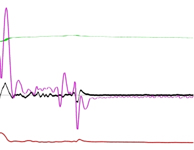
  </a>
</figure>

We see the vertical speed (the violently shaky pink line) trying to stay near zero, but we can also see that ultralight aircraft are... well, ultra light. The spikes in vspeed are from updrafts and pervasive wind, resulting in our altitude (The green line at the top) not actually being a straight line until we hit smooth air. Looking at what happens over time, we see that our code is doing its best to get us back to zero... and despite the wind's best efforts, succeeding at it.

Similarly, we see that we're trying to fly straight (the black center line showing how much we're banking), but that our heading (in red at the bottom) is a bit wibbly: again, when you're this light, you're basically pretending not to be a kite. However, we also see our code doing a pretty good job at keeping us level even if wind gusts are blowing us around.

What about a heavier aircraft, like the DHC-2 Beaver?

<figure style="width: 40%; margin: auto; margin-bottom: 1em;">
  <a href="beaver-vsh-lvl.png" target="_blank">
    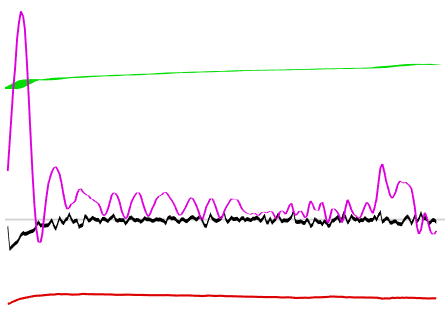
  </a>
</figure>

Turns out having some more mass lets the autopilot code converge to a stable situation much faster, with the wind having less of an effect on the plane from moment to moment, but it's still going to jostle us around. We can see there's a constant updraft, but our vertical hold code at least trying to push us down, "winning" over the updraft and pushing us back to zero, at which point the updraft wins again, rinse and repeat until the updraft's gone. However, in terms of our leveling code, our heading is much more stable: cross wind has far less of an effect on a heavier plane.

So what about a faster plane? Let's see what happens for the Cessna 310R.

<figure style="width: 40%; margin: auto; margin-bottom: 1em;">
  <a href="310r-vsh-lvl.png" target="_blank">
    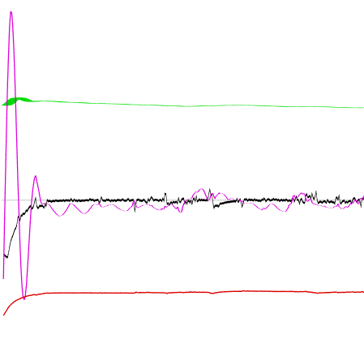
  </a>
</figure>

We start into the autopilot with a significant vertical speed, so we see an initial correction that converges about as fast as the Beaver, after which we see the opposite of the Beaver's updraft behaviour: the vertical hold code paired with the speed of the plane means that we mostly "win" once our vertical hold code kicks in, and we dip below zero. Our overall altitude drops a little, but not as much as the Beaver's went up. We also see that going fast really helps in keeping you going straight: our heading is a much straighter line than for the Beaver, showing significantly less drift.

Confident that we have a reasonable enough base to build on, let's move on and enhance our autopilot code with heading and altitude hold modes.

### Adding heading mode

Of course, an autopilot that doesn't actually fly in the direction you need it to is kind of... silly? Sure, not falling out of the sky is useful, but it's not as useful as "flying in the direction you actually want to go", so: let's add a **heading mode**, where we say which compass direction we want to fly in, and have it make sure we end up flying in that direction. For this, we're going to update our level mode code with some more code:

```python
def fly_level(auto_pilot, state):
  anchor = auto_pilot.anchor

  # Since we're now turning the plane for long periods, we want to make
  # sure that we're using safe(ish) maximum bank values. The faster a
  # plane flies, the more it can bank without "falling out of the sky":
  bank = degrees(state.bank_angle)
  max_bank = constrain_map(state.speed, 50, 200, 10, 30)

  dBank = state.dBank
  max_dBank = radians(1)

  # We're going to let faster planes bank a bit faster than slow ones
  step = constrain_map(state.speed, 50, 150, radians(1), radians(2))
  target_bank = 0

  # And, because we're now intentionally turning for long periods, we also
  # want to make sure that we're not turning too fast so as to be uncomfortable.
  turn_rate = degrees(state.turn_rate)
  max_turn_rate = 3

  # And because we're now supposed to fly in a specific compass direction,
  # track the difference between our "current course" and desired heading.
  flight_heading = auto_pilot.modes[HEADING_MODE]
  if flight_heading:
    h_diff = get_compass_diff(degrees(state.heading), flight_heading)
    target_bank = -constrain_map(h_diff, -30, 30, -max_bank, max_bank)

  # Even though the target_bank is not necessarily zero, the next
  # bits are exactly the same: they just keep working =)
  diff = target_bank - bank
  anchor.x += constrain_map(diff, ...)
  anchor.x += constrain_map(dBank, ...)

  # This part is new though:
  if flight_heading:
    # If we're flying a heading, we need to make sure we're not
    # turning too fast.The closer to our target we get, the smaller
    # our allowed turn rate should be:
    max_turn_rate = constrain_map(abs(h_diff), 0, 10, 0.02, max_turn_rate)
    if turn_rate < -max_turn_rate or turn_rate > max_turn_rate:
      overshoot = turn_rate - max_turn_rate
      if turn_rate < 0:
         overshoot = turn_rate + max_turn_rate
      nudge = constrain_map(overshoot, -max_turn_rate, max_turn_rate, -step/5, step/5)
      anchor.x -= nudge

  auto_pilot.api.set_property_value('AILERON_TRIM_PCT', anchor.x)
```

That looks like a lot more code, but it's mostly "setting up values we'll need" and then two fairly short blocks for the actual heading mode.

The most important part to notice is that our target bank angle is no longer zero: instead, our target bank angle now depends on how far we need to rotate to get to our desired compass heading. If we're 30 or more degrees off, our target bank angle is "the maximum allowed bank angle", and once we get to within 30 degrees, the target bank angle gradually drops until, at the exact compass heading, the target bank angle is zero. This lets us keep our previous code: we were _already_ adjusting our bank angle to match our target bank angle, just now that target might not be zero =)

So that's what the first new block of code sets up. The second block of code makes sure that we don't turn too fast. Bank angles relate to actual turn speed using complex formulae that are different for each aeroplane, and so rather than guessing whether the target bank angle is safe, we simply run the code _as if_ it's safe, and then roll back a little if it turns out we're turning too fast.

In this block, we see the same idea as we applied to bank angles: there is our turn_rate, and there is a maximum turn rate that depends on how close to our desired heading we are. We're a little less strict with turn rate: as long as we're more than 10 degrees (rather than 30) away, our maximum turn rate is unaffected, and then as we get closer to our desired heading, that max value drops off until it's a very low, not non-zero, value. You'd think we want a turn rate of zero, but again: the weather conspires against us, and we're _always_ going to have a small turn rate even if we're perfectly trimmed. Might as well bake that into our expectation.

And that's it, again: not _actually_ a lot of code, but we now have a heading mode and we can tell our plane to fly where _we_ want it to go, rather than where _it_ wants to go =)

### How well does this fly?

Let's look at some graphs again to see how things behave, with some additions to our webpage so we can set some values. First we update our `index.html`:

```html
<div id="autopilot">
  <button class="master">AP</button>
  <button class="LVL">level mode</button>
  <input class="heading" type="number" value="60">
  <button class="HDG">fly heading</button>
  <button class="VSH">vertical hold</button>
</div>
```

And some more JS:

```javascript
const AP_URL = `http://localhost:8080/autopilot/`
const ap = document.getElementById(`autopilot`);
const callAP = (suffix=``) => fetch(AP_URL + suffix, { method: `POST` });
ap.querySelector(`.master`).addEventListener(`click`, () => callAP());
ap.querySelector(`.LVL`).addEventListener(`click`, () => callAP(`?type=LVL`));
ap.querySelector(`.VSH`).addEventListener(`click`, () => callAP(`?type=VSH`));
ap.querySelector(`.HDG`).addEventListener(`click`, () => {
    const heading = ap.querySelector(`.heading`).value;
    callAP(`?type=HDG&target=${heading}`);
});
```

We'll get the planes to fly mostly level with a heading of 60 manually first, then engage the autopilot with vertical hold and heading mode engaged for 60, then adjust our heading to 70, 100, 200, and back to 60.

First up, the Top Rudder 103 Solo:

<figure style="width: 50%; margin: auto; margin-bottom: 1em;">
  <a href="top-rudder-vsh-lvl.png" target="_blank">
    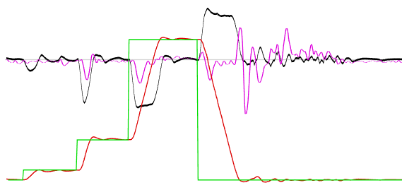
  </a>
</figure>

We see that it's actually doing pretty well! Jumping 10, 30, 100, and 140 degrees all seem to get to their target fast enough, there's a bit of overshoot, and a bit of an oscillating convergence, but for the most part it's doing what it needs to do (especially for a plane that technically has no trim controls). We do see a rather prolonged oscillation at the end, but that's mostly because that was right when the plane was flying over a river delta and the wind decided to have some fun.

What about the Beaver?

<figure style="width: 50%; margin: auto; margin-bottom: 1em;">
  <a href="beaver-vsh-lvl.png" target="_blank">
    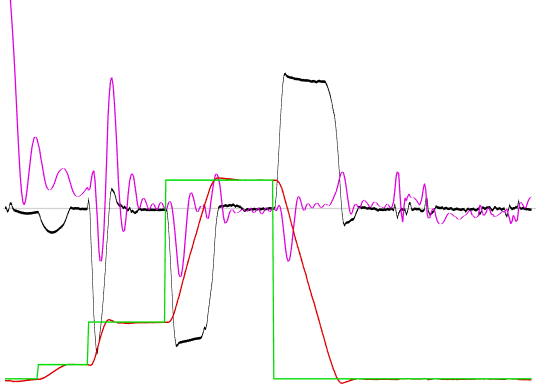
  </a>
</figure>

Slightly less overshoot, and similar heading holding action. Nice! So what about our (much) faster 130R?

<figure style="width: 50%; margin: auto; margin-bottom: 1em;">
  <a href="310r-vsh-lvl.png" target="_blank">
    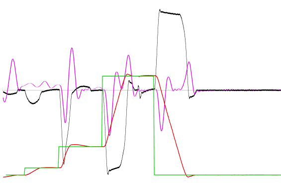
  </a>
</figure>

Similar curves to the Beaver: pretty good!

### Implementing Altitude Hold

Which brings us to the last mode: altitude hold. And if you're thinking "are we going to bolt some code on top of vertical hold, the same way we bolted some heading code on top of level mode?" then you're exactly right!

Just like how heading mode works by giving a non-zero target to aim for, dropping to zero the closer we get to our intended heading, we're going to implement altitude hold by changing the vertical speed target to some non-negative value, dropping to zero as we get closer to our desired altitude.

```python
def hold_altitude(auto_pilot, state):
  # ...
  # All the code up to here is the exact same!
  # ...

  target_VS = 0

  # But if we need to reach a specific altitude, that value will be non-zero:
  target_altitude = auto_pilot.modes[ALTITUDE_HOLD]
  if target_altitude:
    alt_diff = target_altitude - state.altitude
    target_VS = constrain_map(alt_diff, -200, 200, -max_VS, max_VS)

  # ...
  # And then the rest of the code is, again, the exact same!
  # ...

  auto_pilot.api.set_property_value('ELEVATOR_TRIM_POSITION', anchor.y)

```

And that's it, even less code than heading mode! We have everything else already in place, including making sure of safe vertical speeds, so all we need to do is make sure that we set a non-zero vertical speed as target speed while we're not near our target altitude (capped once we reach an altitude difference of 200 feet)  and then slowly decrease that to (near) zero as we reach the desired altitude.

### How well does this fly?

Again, first some more HTML:

```html
<div id="autopilot">
  <button class="master">AP</button>
  <button class="LVL">level mode</button>
  <input class="heading" type="number" value="60">
  <button class="HDG">fly heading</button>
  <button class="VSH">vertical hold</button>
  <input class="altitude" type="number" value="1500">
  <button class="ALT">hold altitude</button>
</div>
```

And some more JS:

```javascript
const AP_URL = `http://localhost:8080/autopilot/`
const ap = document.getElementById(`autopilot`);
const callAP = (suffix=``) => fetch(AP_URL + suffix, { method: `POST` });
ap.querySelector(`.master`).addEventListener(`click`, () => callAP());
ap.querySelector(`.LVL`).addEventListener(`click`, () => callAP(`?type=LVL`));
ap.querySelector(`.VSH`).addEventListener(`click`, () => callAP(`?type=VSH`));
ap.querySelector(`.HDG`).addEventListener(`click`, () => {
    const heading = ap.querySelector(`.heading`).value;
    callAP(`?type=HDG&target=${heading}`);
});
ap.querySelector(`.ALT`).addEventListener(`click`, () => {
    const altitude = ap.querySelector(`.altitude`).value;
    callAP(`?type=ALT&target=${altitude}`);
});
```

And then: let's find out! Again, we'll profile our three aircraft, this time setting a target heading of 60 degrees with target altitude of 1500 feet, then once we get there, we'll pop up to 2500 feet, and then once we get to that, we'll drop back to 1500 feet.

First up again is the Top Rudder 103 Solo:

<figure style="width: 50%; margin: auto; margin-bottom: 1em;">
  <a href="rudder-crash.png" target="_blank">
    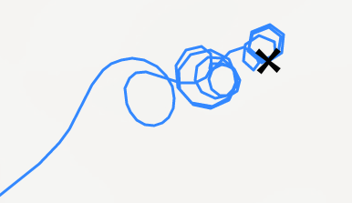
  </a>
</figure>

Oh... oh dear...

<figure style="width: 50%; margin: auto; margin-bottom: 1em;">
  <a href="rudder-crash-graph.png" target="_blank">
    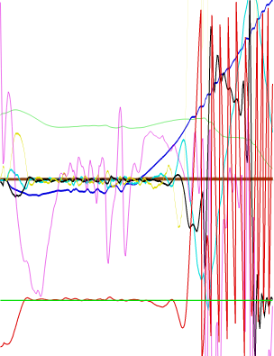
  </a>
</figure>

The Top Rudder might be nimble, but asking it to pretend it's a plane capable of transitioning 1000 feet at a time is maybe asking a little too much of it. We can see it trying to climb, but as it climbs, it's losing speed, and even though it's only climbing at a mere 300 feet per minute, at some point our airspeed drops to something low enough that the aircraft stalls, and we end up in a death spiral. We can fairly easily recover from this if we turn off the autopilot, but if we keep it on... happy birthday to the ground. The lesson: even if we can cram an autopilot into an ultralight, we still need to be realistic about what it can do =)

So what about the Beaver?

<figure style="width: 50%; margin: auto; margin-bottom: 1em;">
  <a href="beaver-alt-hdg.png" target="_blank">
    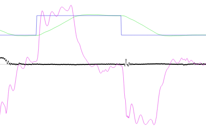
  </a>
</figure>

Marking the target altitude with the blue block line up top, and our vertical speed in wibbly pink, this looks reasonably good: when we tell the autopilot to switch altitudes from 1500 feet to 2500 feet, we incur a positive vertical speed, keep it positive for as long as necessary, and then ramp back down to zero once we reach our new altitude. And then running the reverse shows the same behaviour, just mirrored.

So let's look at what the 310R does with this code:

<figure style="width: 50%; margin: auto; margin-bottom: 1em;">
  <a href="310r-alt-hdg.png" target="_blank">
    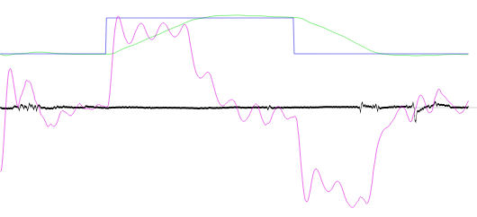
  </a>
</figure>

A similar story, although we're seeing it take an awfully long time to correct for the over/undershoot. The plane recovers from less than 100 feet to 50 quickly enough, but then lingers at the wrong altitude seemingly forever. That's annoying, but not a deal breaker, and we've spent a fair amount of time on this already, so...

## We have an autopilot!

Now, it's not a *great* autopilot, but it works (for the most part, for most planes =) and more importantly, it gives us something to play with. We can refine the way heading mode and altitude hold work, we can tweak numbers to see what happens, we can invent new interpolation functions to use instead of `constrain_map`, there's a lot we can do! In fact, mix in some [Open-Elevation](https://open-elevation.com/) based on "current location" and "location 10 nautical miles ahead of me", get the elevation map for the next 10 miles, and then pick a safe elevation to hold, now we have "terrain follow" mode... there's a *lot* of fun left to be had!

# And that's it for now

So this has been quite a lot of fun: we learned a bit about how an autopilot works, made a full autopilot, and then went even further and made it do something that doesn't even exist in the real world. Mission accomplished, and then some, I'd say.

If you made it this far in this write-up, thank you for reading, and I hope you have a great day!

As for me, I'm going to fly a [Top Rudder](https://www.toprudderaircraft.com/103sologallery) around New Zealand a bit, then maybe hang out in my backyard on Vancouver Island in a [DHC-2 Beaver](https://www.vikingair.com/viking-aircraft/dhc-2-beaver) with floats, and then maybe do some exploratory flying in a [Kodiak 100](https://kodiak.aero/kodiak/).

Say hi if you see me!

(And if you have ideas on how to improve this code without substantially lengthening it, let me know! It's easy enough to write code that has a million code paths for specific combinations of factors, but writing as little code as possible to cover as many planes as possible is a far more challenging task indeed)

# Questions or comments

Hit up the [github repository](https://github.com/Pomax/are-we-flying/issues) if you have any questions or comments, and let's talk!
